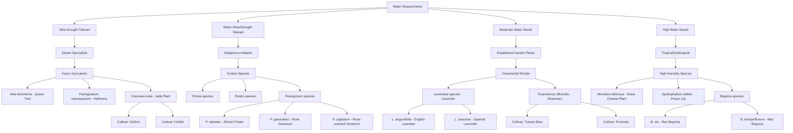

# SA Plant Categorization Trees

```mermaid
%% SEASONAL PATTERNS TREE
graph TD
    SP[Seasonal Patterns] --> SP1[Summer Growing Season]
    SP --> SP2[Winter Growing Season]
    SP --> SP3[Year-Round Growing]
    
    SP1 --> SP1a[October-March Active]
    SP1a --> SP1a1[Summer Rainfall Species]
    SP1a1 --> SP1a1a[Aloe ferox - Bitter Aloe]
    SP1a1 --> SP1a1b[Strelitzia reginae - Bird of Paradise]
    SP1a1 --> SP1a1c[Clivia miniata - Bush Lily]
    SP1a1c --> SP1a1c1[Cultivar: Belgian Hybrids]
    SP1a1c --> SP1a1c2[Cultivar: Daruma]
    SP1a1c --> SP1a1c3[Cultivar: Yellow Lady]
    
    SP2 --> SP2a[May-September Active]
    SP2a --> SP2a1[Winter Rainfall Species]
    SP2a1 --> SP2a1a[Protea cynaroides - King Protea]
    SP2a1a --> SP2a1a1[Cultivar: Little Prince]
    SP2a1a --> SP2a1a2[Cultivar: Madiba]
    SP2a1a --> SP2a1a3[Cultivar: Mini King]
    SP2a1 --> SP2a1b[Leucadendron argenteum - Silver Tree]
    SP2a1 --> SP2a1c[Erica species - Heaths]
    SP2a1c --> SP2a1c1[Erica verticillata - Whorled Heath]
    SP2a1c --> SP2a1c2[Erica mammosa - Nine-pin Heath]
    SP2a1c --> SP2a1c3[Erica baccans - Berry Heath]
    
    SP3 --> SP3a[Minimal Seasonality]
    SP3a --> SP3a1[Succulent Species]
    SP3a1 --> SP3a1a[Portulacaria afra - Spekboom]
    SP3a1a --> SP3a1a1[Variegated Form]
    SP3a1a --> SP3a1a2[Prostrate Form]
    SP3a1 --> SP3a1b[Lithops species - Living Stones]
    SP3a1b --> SP3a1b1[L. lesliei subspecies]
    SP3a1b --> SP3a1b2[L. optica subspecies]
    SP3a1 --> SP3a1c[Haworthia species]
    SP3a1c --> SP3a1c1[H. cooperi var. truncata]
    SP3a1c --> SP3a1c2[H. attenuata - Zebra Plant]
```

```mermaid
%% WATER REQUIREMENTS TREE
graph TD
    WR[Water Requirements] --> WR1[Ultra Drought Tolerant]
    WR --> WR2[Water-Wise/Drought Tolerant]
    WR --> WR3[Moderate Water Needs]
    WR --> WR4[High Water Needs]
    
    WR1 --> WR1a[Desert Specialists]
    WR1a --> WR1a1[Karoo Succulents]
    WR1a1 --> WR1a1a[Aloe dichotoma - Quiver Tree]
    WR1a1 --> WR1a1b[Pachypodium namaquanum - Halfmens]
    WR1a1 --> WR1a1c[Crassula ovata - Jade Plant]
    WR1a1c --> WR1a1c1[Cultivar: Gollum]
    WR1a1c --> WR1a1c2[Cultivar: Hobbit]
    
    WR2 --> WR2a[Indigenous Adapted]
    WR2a --> WR2a1[Fynbos Species]
    WR2a1 --> WR2a1a[Protea species]
    WR2a1 --> WR2a1b[Restio species]
    WR2a1 --> WR2a1c[Pelargonium species]
    WR2a1c --> WR2a1c1[P. sidoides - African Potato]
    WR2a1c --> WR2a1c2[P. graveolens - Rose Geranium]
    WR2a1c --> WR2a1c3[P. capitatum - Rose-scented Geranium]
    
    WR3 --> WR3a[Established Garden Plants]
    WR3a --> WR3a1[Ornamental Shrubs]
    WR3a1 --> WR3a1a[Lavandula species - Lavender]
    WR3a1a --> WR3a1a1[L. angustifolia - English Lavender]
    WR3a1a --> WR3a1a2[L. stoechas - Spanish Lavender]
    WR3a1 --> WR3a1b[Rosmarinus officinalis - Rosemary]
    WR3a1b --> WR3a1b1[Cultivar: Tuscan Blue]
    WR3a1b --> WR3a1b2[Cultivar: Prostrate]
    
    WR4 --> WR4a[Tropical/Subtropical]
    WR4a --> WR4a1[High Humidity Species]
    WR4a1 --> WR4a1a[Monstera deliciosa - Swiss Cheese Plant]
    WR4a1 --> WR4a1b[Spathiphyllum wallisii - Peace Lily]
    WR4a1 --> WR4a1c[Begonia species]
    WR4a1c --> WR4a1c1[B. rex - Rex Begonia]
    WR4a1c --> WR4a1c2[B. semperflorens - Wax Begonia]
```

```mermaid
%% PLANT SIZE CATEGORIES TREE
graph TD
    PSC[Plant Size Categories] --> PSC1[Ground Covers]
    PSC --> PSC2[Small Shrubs]
    PSC --> PSC3[Medium Shrubs]
    PSC --> PSC4[Large Shrubs]
    PSC --> PSC5[Small Trees]
    PSC --> PSC6[Large Trees]
    
    PSC1 --> PSC1a[0-0.3m Height]
    PSC1a --> PSC1a1[Spreading/Mat-forming]
    PSC1a1 --> PSC1a1a[Lampranthus species - Ice Plants]
    PSC1a1a --> PSC1a1a1[L. spectabilis - Trailing Ice Plant]
    PSC1a1a --> PSC1a1a2[L. aureus - Golden Ice Plant]
    PSC1a1 --> PSC1a1b[Carpobrotus edulis - Sour Fig]
    PSC1a1 --> PSC1a1c[Gazania rigens - Treasure Flower]
    PSC1a1c --> PSC1a1c1[Cultivar: Daybreak Bronze]
    PSC1a1c --> PSC1a1c2[Cultivar: Tiger Mix]
    
    PSC2 --> PSC2a[0.3-1.5m Height]
    PSC2a --> PSC2a1[Compact Garden Shrubs]
    PSC2a1 --> PSC2a1a[Pelargonium x hortorum - Zonal Geranium]
    PSC2a1a --> PSC2a1a1[Cultivar: Multibloom Series]
    PSC2a1a --> PSC2a1a2[Cultivar: Orbit Series]
    PSC2a1 --> PSC2a1b[Erica species - Heaths]
    PSC2a1 --> PSC2a1c[Salvia species - Sages]
    PSC2a1c --> PSC2a1c1[S. greggii - Autumn Sage]
    PSC2a1c --> PSC2a1c2[S. chamaedryoides - Germander Sage]
    
    PSC3 --> PSC3a[1.5-3m Height]
    PSC3a --> PSC3a1[Standard Garden Shrubs]
    PSC3a1 --> PSC3a1a[Protea repens - Common Sugarbush]
    PSC3a1 --> PSC3a1b[Leucospermum cordifolium - Pincushion]
    PSC3a1b --> PSC3a1b1[Cultivar: High Gold]
    PSC3a1b --> PSC3a1b2[Cultivar: Flame Spike]
    PSC3a1 --> PSC3a1c[Grevillea species]
    PSC3a1c --> PSC3a1c1[G. robusta - Silky Oak]
    PSC3a1c --> PSC3a1c2[G. juniperina - Juniper Grevillea]
    
    PSC4 --> PSC4a[3-6m Height]
    PSC4a --> PSC4a1[Large Screening Shrubs]
    PSC4a1 --> PSC4a1a[Pittosporum viridiflorum - Cheesewood]
    PSC4a1 --> PSC4a1b[Buddleja saligna - False Olive]
    PSC4a1 --> PSC4a1c[Leucadendron argenteum - Silver Tree]
    
    PSC5 --> PSC5a[6-12m Height]
    PSC5a --> PSC5a1[Ornamental Trees]
    PSC5a1 --> PSC5a1a[Erythrina lysistemon - Lucky Bean Tree]
    PSC5a1 --> PSC5a1b[Virgilia oroboides - Keurboom]
    PSC5a1 --> PSC5a1c[Jacaranda mimosifolia - Jacaranda]
    PSC5a1c --> PSC5a1c1[Cultivar: White Christmas]
    PSC5a1c --> PSC5a1c2[Standard Purple Form]
    
    PSC6 --> PSC6a[12m+ Height]
    PSC6a --> PSC6a1[Canopy Trees]
    PSC6a1 --> PSC6a1a[Podocarpus latifolius - Yellowwood]
    PSC6a1 --> PSC6a1b[Ficus sycamorus - Sycamore Fig]
    PSC6a1 --> PSC6a1c[Adansonia digitata - Baobab]
```

```mermaid
%% ENDEMIC PLANT FAMILIES TREE
graph TD
    EPF[Endemic Plant Families] --> EPF1[Proteaceae]
    EPF --> EPF2[Aizoaceae]
    EPF --> EPF3[Asphodelaceae]
    EPF --> EPF4[Geraniaceae]
    EPF --> EPF5[Ericaceae]
    
    EPF1 --> EPF1a[Protea Genus]
    EPF1a --> EPF1a1[Large Proteas]
    EPF1a1 --> EPF1a1a[P. cynaroides - King Protea]
    EPF1a1a --> EPF1a1a1[Subspecies: cynaroides]
    EPF1a1a --> EPF1a1a2[Cultivar: Little Prince]
    EPF1a1a --> EPF1a1a3[Cultivar: Madiba]
    EPF1a1 --> EPF1a1b[P. magnifica - Queen Protea]
    EPF1a --> EPF1a2[Medium Proteas]
    EPF1a2 --> EPF1a2a[P. repens - Common Sugarbush]
    EPF1a2 --> EPF1a2b[P. neriifolia - Narrow-leaf Sugarbush]
    
    EPF1 --> EPF1b[Leucospermum Genus]
    EPF1b --> EPF1b1[Nodding Pincushions]
    EPF1b1 --> EPF1b1a[L. cordifolium - Heart-leaf Pincushion]
    EPF1b1a --> EPF1b1a1[Cultivar: High Gold]
    EPF1b1a --> EPF1b1a2[Cultivar: Flame Spike]
    EPF1b --> EPF1b2[Upright Pincushions]
    EPF1b2 --> EPF1b2a[L. reflexum - Rocket Pincushion]
    EPF1b2 --> EPF1b2b[L. lineare - Narrow-leaf Pincushion]
    
    EPF1 --> EPF1c[Leucadendron Genus]
    EPF1c --> EPF1c1[Cone Bushes]
    EPF1c1 --> EPF1c1a[L. argenteum - Silver Tree]
    EPF1c1 --> EPF1c1b[L. laureolum - Golden Cone Bush]
    EPF1c1 --> EPF1c1c[L. salignum - Common Cone Bush]
    
    EPF2 --> EPF2a[Mesembryanthemaceae]
    EPF2a --> EPF2a1[Ice Plants]
    EPF2a1 --> EPF2a1a[Lampranthus spectabilis]
    EPF2a1a --> EPF2a1a1[Pink Form]
    EPF2a1a --> EPF2a1a2[Purple Form]
    EPF2a1a --> EPF2a1a3[Orange Form]
    EPF2a1 --> EPF2a1b[Carpobrotus edulis - Sour Fig]
    EPF2a --> EPF2a2[Living Stones]
    EPF2a2 --> EPF2a2a[Lithops lesliei]
    EPF2a2a --> EPF2a2a1[Subspecies: lesliei]
    EPF2a2a --> EPF2a2a2[Subspecies: venteri]
    EPF2a2 --> EPF2a2b[Lithops optica]
    
    EPF3 --> EPF3a[Aloe Genus]
    EPF3a --> EPF3a1[Tree Aloes]
    EPF3a1 --> EPF3a1a[A. barberae - Tree Aloe]
    EPF3a1 --> EPF3a1b[A. dichotoma - Quiver Tree]
    EPF3a --> EPF3a2[Shrub Aloes]
    EPF3a2 --> EPF3a2a[A. ferox - Bitter Aloe]
    EPF3a2 --> EPF3a2b[A. arborescens - Krantz Aloe]
    EPF3a --> EPF3a3[Grass Aloes]
    EPF3a3 --> EPF3a3a[A. striata - Coral Aloe]
    EPF3a3 --> EPF3a3b[A. brevifolia - Short-leaf Aloe]
    
    EPF4 --> EPF4a[Pelargonium Genus]
    EPF4a --> EPF4a1[Scented-leaf Species]
    EPF4a1 --> EPF4a1a[P. graveolens - Rose Geranium]
    EPF4a1 --> EPF4a1b[P. tomentosum - Peppermint Geranium]
    EPF4a1 --> EPF4a1c[P. citronellum - Citronella Geranium]
    EPF4a --> EPF4a2[Flowering Species]
    EPF4a2 --> EPF4a2a[P. peltatum - Ivy Geranium]
    EPF4a2a --> EPF4a2a1[Cultivar: Cascade Series]
    EPF4a2a --> EPF4a2a2[Cultivar: Summer Showers]
    EPF4a2 --> EPF4a2b[P. x hortorum - Zonal Geranium]

    EPF5 --> EPF5a[Erica Genus]
    EPF5a --> EPF5a1[Tall Heaths]
    EPF5a1 --> EPF5a1a[E. mammosa - Nine-pin Heath]
    EPF5a1 --> EPF5a1b[E. verticillata - Whorled Heath]
    EPF5a --> EPF5a2[Compact Heaths]
    EPF5a2 --> EPF5a2a[E. baccans - Berry Heath]
    EPF5a2 --> EPF5a2b[E. grandiflora - Large-flowered Heath]
```

```mermaid
%% COMMERCIAL CATEGORIES TREE
graph TD
    CC[Commercial Categories] --> CC1[Indigenous Plants]
    CC --> CC2[Exotic Ornamentals]
    CC --> CC3[Edible Plants]
    CC --> CC4[Medicinal Plants]
    CC --> CC5[Specialty Collections]
    
    CC1 --> CC1a[Fynbos Plants]
    CC1a --> CC1a1[Cut Flower Species]
    CC1a1 --> CC1a1a[Protea cynaroides - King Protea]
    CC1a1 --> CC1a1b[Leucospermum cordifolium - Pincushion]
    CC1a1 --> CC1a1c[Leucadendron species - Cone Bush]
    CC1a --> CC1a2[Garden Specimens]
    CC1a2 --> CC1a2a[Erica species - Heaths]
    CC1a2 --> CC1a2b[Restio species - Cape Reeds]
    CC1a2 --> CC1a2c[Pelargonium species - Wild Geraniums]
    
    CC1 --> CC1b[Water-wise Indigenous]
    CC1b --> CC1b1[Drought Specialists]
    CC1b1 --> CC1b1a[Portulacaria afra - Spekboom]
    CC1b1 --> CC1b1b[Aloe species]
    CC1b1 --> CC1b1c[Crassula species - Jade Plants]
    CC1b --> CC1b2[Coastal Species]
    CC1b2 --> CC1b2a[Carpobrotus edulis - Sour Fig]
    CC1b2 --> CC1b2b[Gazania species - Treasure Flowers]
    
    CC2 --> CC2a[Temperate Ornamentals]
    CC2a --> CC2a1[European Herbs]
    CC2a1 --> CC2a1a[Lavandula angustifolia - English Lavender]
    CC2a1a --> CC2a1a1[Cultivar: Hidcote]
    CC2a1a --> CC2a1a2[Cultivar: Munstead]
    CC2a1 --> CC2a1b[Rosmarinus officinalis - Rosemary]
    CC2a1b --> CC2a1b1[Cultivar: Tuscan Blue]
    CC2a1b --> CC2a1b2[Cultivar: Prostrate]
    CC2a --> CC2a2[Mediterranean Imports]
    CC2a2 --> CC2a2a[Olea europaea - Olive]
    CC2a2a --> CC2a2a1[Cultivar: Frantoio]
    CC2a2a --> CC2a2a2[Cultivar: Mission]
    
    CC2 --> CC2b[Tropical Ornamentals]
    CC2b --> CC2b1[Houseplants]
    CC2b1 --> CC2b1a[Monstera deliciosa - Swiss Cheese Plant]
    CC2b1 --> CC2b1b[Spathiphyllum wallisii - Peace Lily]
    CC2b1 --> CC2b1c[Sansevieria trifasciata - Snake Plant]
    CC2b1c --> CC2b1c1[Cultivar: Laurentii]
    CC2b1c --> CC2b1c2[Cultivar: Hahnii]
    
    CC3 --> CC3a[Herbs & Vegetables]
    CC3a --> CC3a1[Culinary Herbs]
    CC3a1 --> CC3a1a[Origanum vulgare - Oregano]
    CC3a1 --> CC3a1b[Thymus vulgaris - Thyme]
    CC3a1 --> CC3a1c[Petroselinum crispum - Parsley]
    CC3a1c --> CC3a1c1[Flat-leaf Variety]
    CC3a1c --> CC3a1c2[Curly-leaf Variety]
    CC3a --> CC3a2[Indigenous Edibles]
    CC3a2 --> CC3a2a[Carpobrotus edulis - Sour Fig]
    CC3a2 --> CC3a2b[Pelargonium sidoides - African Potato]
    CC3a2 --> CC3a2c[Sutherlandia frutescens - Cancer Bush]
    
    CC3 --> CC3b[Fruit Trees]
    CC3b --> CC3b1[Citrus Species]
    CC3b1 --> CC3b1a[Citrus sinensis - Sweet Orange]
    CC3b1a --> CC3b1a1[Cultivar: Valencia Late]
    CC3b1a --> CC3b1a2[Cultivar: Navel]
    CC3b1 --> CC3b1b[Citrus limon - Lemon]
    CC3b1b --> CC3b1b1[Cultivar: Meyer]
    CC3b1b --> CC3b1b2[Cultivar: Eureka]
    CC3b --> CC3b2[Indigenous Fruits]
    CC3b2 --> CC3b2a[Syzygium cordatum - Water Berry]
    CC3b2 --> CC3b2b[Carissa macrocarpa - Natal Plum]
    
    CC4 --> CC4a[Traditional Medicine]
    CC4a --> CC4a1[Respiratory Ailments]
    CC4a1 --> CC4a1a[Pelargonium sidoides - African Potato]
    CC4a1 --> CC4a1b[Artemisia afra - African Wormwood]
    CC4a --> CC4a2[Immune Support]
    CC4a2 --> CC4a2a[Sutherlandia frutescens - Cancer Bush]
    CC4a2 --> CC4a2b[Hypoxis hemerocallidea - African Star Grass]
    CC4a --> CC4a3[Digestive Health]
    CC4a3 --> CC4a3a[Aloe ferox - Bitter Aloe]
    CC4a3 --> CC4a3b[Centella asiatica - Pennywort]
    
    CC5 --> CC5a[Succulent Collections]
    CC5a --> CC5a1[Rare Specimens]
    CC5a1 --> CC5a1a[Lithops species - Living Stones]
    CC5a1a --> CC5a1a1[L. lesliei - Leslie's Living Stone]
    CC5a1a --> CC5a1a2[L. optica - Window Plant]
    CC5a1 --> CC5a1b[Haworthia species]
    CC5a1b --> CC5a1b1[H. cooperi var. truncata]
    CC5a1b --> CC5a1b2[H. obtusa - Lens Plant]
    CC5a --> CC5a2[Beginner-Friendly]
    CC5a2 --> CC5a2a[Crassula ovata - Jade Plant]
    CC5a2a --> CC5a2a1[Cultivar: Gollum]
    CC5a2a --> CC5a2a2[Cultivar: Hobbit]
    CC5a2 --> CC5a2b[Portulacaria afra - Spekboom]
    
    CC5 --> CC5b[Bonsai Collections]
    CC5b --> CC5b1[Indigenous Bonsai]
    CC5b1 --> CC5b1a[Celtis africana - White Stinkwood]
    CC5b1 --> CC5b1b[Olea europaea ssp. africana - Wild Olive]
    CC5b --> CC5b2[Exotic Bonsai]
    CC5b2 --> CC5b2a[Ficus benjamina - Weeping Fig]
    CC5b2 --> CC5b2b[Serissa foetida - Tree of a Thousand Stars]
```

```mermaid
%% CONSERVATION STATUS TREE
graph TD
    CS[Conservation Status] --> CS1[Extinct in Wild]
    CS --> CS2[Critically Endangered]
    CS --> CS3[Endangered]
    CS --> CS4[Vulnerable]
    CS --> CS5[Near Threatened]
    CS --> CS6[Least Concern]
    CS --> CS7[Data Deficient]
    
    CS1 --> CS1a[Nursery Propagation Only]
    CS1a --> CS1a1[Erica verticillata - Whorled Heath]
    CS1a1 --> CS1a1a[Cultivated Population Only]
    CS1a1 --> CS1a1b[Reintroduction Programs]
    
    CS2 --> CS2a[Habitat Loss Specialists]
    CS2a --> CS2a1[Leucadendron argenteum - Silver Tree]
    CS2a1 --> CS2a1a[Peninsula Granite Fynbos Endemic]
    CS2a1 --> CS2a1b[Urban Development Pressure]
    CS2a --> CS2a2[Protea odorata - Sweet Protea]
    CS2a2 --> CS2a2a[Swartland Shale Fynbos]
    CS2a2 --> CS2a2b[Agricultural Conversion]
    
    CS3 --> CS3a[Range-Restricted Species]
    CS3a --> CS3a1[Disa uniflora - Red Disa]
    CS3a1 --> CS3a1a[Table Mountain Seeps]
    CS3a1 --> CS3a1b[Water Table Changes]
    CS3a --> CS3a2[Encephalartos altensteinii - Eastern Cape Cycad]
    CS3a2 --> CS3a2a[Illegal Collection Pressure]
    CS3a2 --> CS3a2b[Habitat Fragmentation]
    
    CS4 --> CS4a[Climate Change Vulnerable]
    CS4a --> CS4a1[Protea magnifica - Queen Protea]
    CS4a1 --> CS4a1a[High Altitude Specialist]
    CS4a1 --> CS4a1b[Temperature Sensitivity]
    CS4a --> CS4a2[Aloe dichotoma - Quiver Tree]
    CS4a2 --> CS4a2a[Rainfall Pattern Changes]
    CS4a2 --> CS4a2b[Karoo Distribution Shifts]
    
    CS5 --> CS5a[Stable but Monitored]
    CS5a --> CS5a1[Protea cynaroides - King Protea]
    CS5a1 --> CS5a1a[Wide Distribution Range]
    CS5a1 --> CS5a1b[Commercial Cultivation Success]
    CS5a --> CS5a2[Strelitzia reginae - Bird of Paradise]
    CS5a2 --> CS5a2a[Garden Escapee Populations]
    CS5a2 --> CS5a2b[Horticultural Value Protection]
    
    CS6 --> CS6a[Common Garden Plants]
    CS6a --> CS6a1[Widely Cultivated]
    CS6a1 --> CS6a1a[Pelargonium x hortorum - Zonal Geranium]
    CS6a1a --> CS6a1a1[Global Distribution]
    CS6a1a --> CS6a1a2[Hybrid Vigor]
    CS6a1 --> CS6a1b[Portulacaria afra - Spekboom]
    CS6a1b --> CS6a1b1[Carbon Sequestration Programs]
    CS6a1b --> CS6a1b2[Restoration Projects]
    
    CS7 --> CS7a[Recently Discovered]
    CS7a --> CS7a1[Remote Location Species]
    CS7a1 --> CS7a1a[Mountain Endemics]
    CS7a1 --> CS7a1b[Desert Specialists]
    CS7a --> CS7a2[Taxonomic Uncertainties]
    CS7a2 --> CS7a2a[Species Complex Groups]
    CS7a2 --> CS7a2b[Hybrid Populations]
```

```mermaid
%% CLIMATE ZONES DETAILED TREE
graph TD
    CZD[Climate Zone Details] --> CZD1[Mediterranean Western Cape]
    CZD --> CZD2[Subtropical Eastern Coast]
    CZD --> CZD3[Highland Subtropical Interior]
    CZD --> CZD4[Semi-Arid Karoo]
    CZD --> CZD5[Arid Northern Cape]
    CZD --> CZD6[Coastal Zones]
    
    CZD1 --> CZD1a[Winter Rainfall 400-1500mm]
    CZD1a --> CZD1a1[Fynbos Biome]
    CZD1a1 --> CZD1a1a[Proteaceae Specialists]
    CZD1a1a --> CZD1a1a1[Protea cynaroides - King Protea]
    CZD1a1a --> CZD1a1a2[Leucospermum cordifolium - Pincushion]
    CZD1a1a --> CZD1a1a3[Leucadendron argenteum - Silver Tree]
    CZD1a1 --> CZD1a1b[Ericaceae Family]
    CZD1a1b --> CZD1a1b1[Erica mammosa - Nine-pin Heath]
    CZD1a1b --> CZD1a1b2[Erica verticillata - Whorled Heath]
    CZD1a1 --> CZD1a1c[Restionaceae Family]
    CZD1a1c --> CZD1a1c1[Restio triticeus - Wheat Restio]
    CZD1a1c --> CZD1a1c2[Thamnochortus insignis - Large Restio]
    
    CZD2 --> CZD2a[Summer Rainfall 800-1200mm]
    CZD2a --> CZD2a1[Coastal Forest Species]
    CZD2a1 --> CZD2a1a[Strelitzia nicolai - White Bird of Paradise]
    CZD2a1 --> CZD2a1b[Phoenix reclinata - Wild Date Palm]
    CZD2a1 --> CZD2a1c[Syzygium cordatum - Water Berry]
    CZD2a --> CZD2a2[Grassland Transition]
    CZD2a2 --> CZD2a2a[Clivia miniata - Bush Lily]
    CZD2a2a --> CZD2a2a1[Cultivar: Belgian Hybrids]
    CZD2a2a --> CZD2a2a2[Cultivar: Daruma]
    CZD2a2 --> CZD2a2b[Erythrina lysistemon - Lucky Bean Tree]
    
    CZD3 --> CZD3a[Moderate Rainfall 600-800mm]
    CZD3a --> CZD3a1[Highveld Grassland]
    CZD3a1 --> CZD3a1a[Jacaranda mimosifolia - Jacaranda]
    CZD3a1a --> CZD3a1a1[Standard Purple Form]
    CZD3a1a --> CZD3a1a2[Cultivar: White Christmas]
    CZD3a1 --> CZD3a1b[Olea europaea ssp. africana - Wild Olive]
    CZD3a --> CZD3a2[Urban Adaptable Species]
    CZD3a2 --> CZD3a2a[Buddleja saligna - False Olive]
    CZD3a2 --> CZD3a2b[Celtis africana - White Stinkwood]
    
    CZD4 --> CZD4a[Low Rainfall 200-400mm]
    CZD4a --> CZD4a1[Succulent Karoo]
    CZD4a1 --> CZD4a1a[Aloe dichotoma - Quiver Tree]
    CZD4a1 --> CZD4a1b[Pachypodium namaquanum - Halfmens]
    CZD4a1 --> CZD4a1c[Titanopsis species - Living Granite]
    CZD4a --> CZD4a2[Spiny Shrubs]
    CZD4a2 --> CZD4a2a[Carissa bispinosa - Simple-spine Num-num]
    CZD4a2 --> CZD4a2b[Ehretia rigida - Puzzle Bush]
    
    CZD5 --> CZD5a[Extreme Arid <200mm]
    CZD5a --> CZD5a1[Desert Specialists]
    CZD5a1 --> CZD5a1a[Welwitschia mirabilis - Welwitschia]
    CZD5a1 --> CZD5a1b[Lithops species - Living Stones]
    CZD5a1b --> CZD5a1b1[L. optica - Window Plant]
    CZD5a1b --> CZD5a1b2[L. lesliei - Leslie's Living Stone]
    CZD5a1 --> CZD5a1c[Adromischus species]
    CZD5a1c --> CZD5a1c1[A. cooperi - Plover Eggs Plant]
    CZD5a1c --> CZD5a1c2[A. cristatus - Crinkle-leaf Plant]
    
    CZD6 --> CZD6a[Salt Tolerance Required]
    CZD6a --> CZD6a1[Dune Stabilizers]
    CZD6a1 --> CZD6a1a[Carpobrotus edulis - Sour Fig]
    CZD6a1 --> CZD6a1b[Scaevola taccada - Beach Naupaka]
    CZD6a1 --> CZD6a1c[Tetragonia decumbens - Dune Spinach]
    CZD6a --> CZD6a2[Salt Marsh Species]
    CZD6a2 --> CZD6a2a[Salicornia species - Glasswort]
    CZD6a2 --> CZD6a2b[Limonium species - Sea Lavender]
```

```mermaid
%% GROWTH PATTERNS AND MATURITY TREE
graph TD
    GPM[Growth Patterns & Maturity] --> GPM1[Fast Growing - 1 Season]
    GPM --> GPM2[Moderate Growing - 2-3 Years]
    GPM --> GPM3[Slow Growing - 3-5 Years]
    GPM --> GPM4[Very Slow Growing - 5+ Years]
    
    GPM1 --> GPM1a[Annual/Seasonal Plants]
    GPM1a --> GPM1a1[Herbaceous Annuals]
    GPM1a1 --> GPM1a1a[Gazania rigens - Treasure Flower]
    GPM1a1a --> GPM1a1a1[Germination: 7-14 days]
    GPM1a1a --> GPM1a1a2[Flowering: 8-10 weeks]
    GPM1a1a --> GPM1a1a3[Market Ready: 12-16 weeks]
    GPM1a1 --> GPM1a1b[Pelargonium x hortorum - Zonal Geranium]
    GPM1a1b --> GPM1a1b1[Cutting Propagation: 3-4 weeks]
    GPM1a1b --> GPM1a1b2[Flowering Size: 12-16 weeks]
    GPM1a --> GPM1a2[Fast Herbs]
    GPM1a2 --> GPM1a2a[Ocimum basilicum - Basil]
    GPM1a2a --> GPM1a2a1[Germination: 5-10 days]
    GPM1a2a --> GPM1a2a2[Harvest Ready: 6-8 weeks]
    GPM1a2 --> GPM1a2b[Petroselinum crispum - Parsley]
    
    GPM2 --> GPM2a[Small to Medium Shrubs]
    GPM2a --> GPM2a1[Erica Species - Heaths]
    GPM2a1 --> GPM2a1a[E. mammosa - Nine-pin Heath]
    GPM2a1a --> GPM2a1a1[Seed Germination: 4-8 weeks]
    GPM2a1a --> GPM2a1a2[Saleable Size: 18-24 months]
    GPM2a1a --> GPM2a1a3[Mature Flowering: 2-3 years]
    GPM2a1 --> GPM2a1b[E. baccans - Berry Heath]
    GPM2a --> GPM2a2[Pelargonium Species]
    GPM2a2 --> GPM2a2a[P. graveolens - Rose Geranium]
    GPM2a2a --> GPM2a2a1[Cutting Root: 2-4 weeks]
    GPM2a2a --> GPM2a2a2[Pot Size 140mm: 6-8 months]
    GPM2a2a --> GPM2a2a3[Mature Plant: 2 years]
    
    GPM3 --> GPM3a[Large Shrubs & Small Trees]
    GPM3a --> GPM3a1[Protea Species]
    GPM3a1 --> GPM3a1a[P. cynaroides - King Protea]
    GPM3a1a --> GPM3a1a1[Seed Treatment: Smoke + scarification]
    GPM3a1a --> GPM3a1a2[Germination: 6-12 weeks]
    GPM3a1a --> GPM3a1a3[200mm Pot: 18-24 months]
    GPM3a1a --> GPM3a1a4[Flowering Size: 3-4 years]
    GPM3a1 --> GPM3a1b[P. repens - Common Sugarbush]
    GPM3a --> GPM3a2[Leucospermum Species]
    GPM3a2 --> GPM3a2a[L. cordifolium - Pincushion]
    GPM3a2a --> GPM3a2a1[Grafted Plants: 18 months to flower]
    GPM3a2a --> GPM3a2a2[Seedling Plants: 3-4 years to flower]
    
    GPM4 --> GPM4a[Large Trees & Specialist Plants]
    GPM4a --> GPM4a1[Cycads]
    GPM4a1 --> GPM4a1a[Encephalartos altensteinii - Eastern Cape Cycad]
    GPM4a1a --> GPM4a1a1[Seed Germination: 6-18 months]
    GPM4a1a --> GPM4a1a2[Juvenile Plant: 3-5 years]
    GPM4a1a --> GPM4a1a3[Reproductive Maturity: 15-20 years]
    GPM4a1 --> GPM4a1b[Encephalartos ferox - Fierce Cycad]
    GPM4a --> GPM4a2[Slow Trees]
    GPM4a2 --> GPM4a2a[Podocarpus latifolius - Yellowwood]
    GPM4a2a --> GPM4a2a1[Germination: 8-16 weeks]
    GPM4a2a --> GPM4a2a2[300mm Pot: 3-4 years]
    GPM4a2a --> GPM4a2a3[Planting Size: 5-7 years]
    GPM4a2 --> GPM4a2b[Adansonia digitata - Baobab]
    GPM4a2b --> GPM4a2b1[Germination: 2-6 months]
    GPM4a2b --> GPM4a2b2[Trunk Development: 10+ years]
```

```mermaid
%% PROPAGATION METHODS TREE
graph TD
    PM[Propagation Methods] --> PM1[Seed Propagation]
    PM --> PM2[Vegetative Propagation]
    PM --> PM3[Specialized Techniques]
    PM --> PM4[Tissue Culture]
    
    PM1 --> PM1a[Direct Seeding]
    PM1a --> PM1a1[No Treatment Required]
    PM1a1 --> PM1a1a[Gazania species - Treasure Flowers]
    PM1a1 --> PM1a1b[Lampranthus species - Ice Plants]
    PM1a1 --> PM1a1c[Most Herb Species]
    PM1a --> PM1a2[Scarification Required]
    PM1a2 --> PM1a2a[Hard Seed Coat Species]
    PM1a2a --> PM1a2a1[Erythrina lysistemon - Lucky Bean Tree]
    PM1a2a --> PM1a2a2[Virgilia oroboides - Keurboom]
    PM1a2 --> PM1a2b[File/Sand Paper Treatment]
    
    PM1 --> PM1b[Smoke Treatment]
    PM1b --> PM1b1[Fynbos Fire Adaptation]
    PM1b1 --> PM1b1a[Proteaceae Family]
    PM1b1a --> PM1b1a1[Protea cynaroides - King Protea]
    PM1b1a --> PM1b1a2[Leucospermum cordifolium - Pincushion]
    PM1b1a --> PM1b1a3[Leucadendron species - Cone Bush]
    PM1b1 --> PM1b1b[Ericaceae Family]
    PM1b1b --> PM1b1b1[Erica mammosa - Nine-pin Heath]
    PM1b1b --> PM1b1b2[Erica verticillata - Whorled Heath]
    PM1b --> PM1b2[Smoke Water Application]
    PM1b2 --> PM1b2a[Commercial Smoke Primer]
    PM1b2 --> PM1b2b[Fresh Smoke Treatment]
    
    PM2 --> PM2a[Cutting Propagation]
    PM2a --> PM2a1[Softwood Cuttings]
    PM2a1 --> PM2a1a[Spring/Early Summer Collection]
    PM2a1a --> PM2a1a1[Pelargonium species - Geraniums]
    PM2a1a --> PM2a1a2[Lavandula species - Lavenders]
    PM2a1a --> PM2a1a3[Salvia species - Sages]
    PM2a --> PM2a2[Semi-hardwood Cuttings]
    PM2a2 --> PM2a2a[Late Summer Collection]
    PM2a2a --> PM2a2a1[Portulacaria afra - Spekboom]
    PM2a2a --> PM2a2a2[Crassula ovata - Jade Plant]
    PM2a2a --> PM2a2a3[Most Succulent Species]
    PM2a --> PM2a3[Hardwood Cuttings]
    PM2a3 --> PM2a3a[Winter Dormant Season]
    PM2a3a --> PM2a3a1[Buddleja saligna - False Olive]
    PM2a3a --> PM2a3a2[Olea species - Olives]
    
    PM2 --> PM2b[Division Methods]
    PM2b --> PM2b1[Bulb/Rhizome Division]
    PM2b1 --> PM2b1a[Clivia miniata - Bush Lily]
    PM2b1a --> PM2b1a1[Rhizome Division: Post-flowering]
    PM2b1a --> PM2b1a2[Offset Separation]
    PM2b1 --> PM2b1b[Agapanthus species]
    PM2b --> PM2b2[Clump Division]
    PM2b2 --> PM2b2a[Aloe species - Stemless Forms]
    PM2b2 --> PM2b2b[Haworthia species]
    
    PM3 --> PM3a[Grafting Techniques]
    PM3a --> PM3a1[Protea Grafting]
    PM3a1 --> PM3a1a[Rootstock Selection]
    PM3a1a --> PM3a1a1[P. obtusifolia - Limestone Protea]
    PM3a1a --> PM3a1a2[P. susannae - Stink-leaf Protea]
    PM3a1 --> PM3a1b[Scion Preparation]
    PM3a1b --> PM3a1b1[P. cynaroides - King Protea]
    PM3a1b --> PM3a1b2[P. magnifica - Queen Protea]
    PM3a --> PM3a2[Citrus Grafting]
    PM3a2 --> PM3a2a[Rootstock: Rough Lemon]
    PM3a2 --> PM3a2b[Rootstock: Trifoliate Orange]
    
    PM3 --> PM3b[Air Layering]
    PM3b --> PM3b1[Difficult-to-Root Species]
    PM3b1 --> PM3b1a[Ficus species - Fig Trees]
    PM3b1 --> PM3b1b[Large Protea Species]
    PM3b1 --> PM3b1c[Mature Tree Propagation]
    
    PM4 --> PM4a[Commercial Tissue Culture]
    PM4a --> PM4a1[Mass Production Species]
    PM4a1 --> PM4a1a[Phoenix species - Date Palms]
    PM4a1 --> PM4a1b[Strelitzia reginae - Bird of Paradise]
    PM4a1 --> PM4a1c[Protea cultivars]
    PM4a --> PM4a2[Disease-Free Stock]
    PM4a2 --> PM4a2a[Virus Elimination]
    PM4a2 --> PM4a2b[Clean Mother Stock]
    PM4 --> PM4b[Specialized Applications]
    PM4b --> PM4b1[Rare Species Conservation]
    PM4b1 --> PM4b1a[Encephalartos species - Cycads]
    PM4b1 --> PM4b1b[Threatened Protea Species]
    PM4b --> PM4b2[Hybrid Development]
    PM4b2 --> PM4b2a[Interspecific Crosses]
    PM4b2 --> PM4b2b[Cultivar Selection]
```
