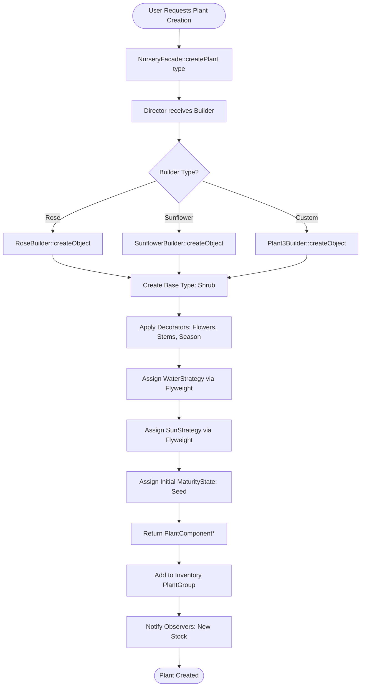
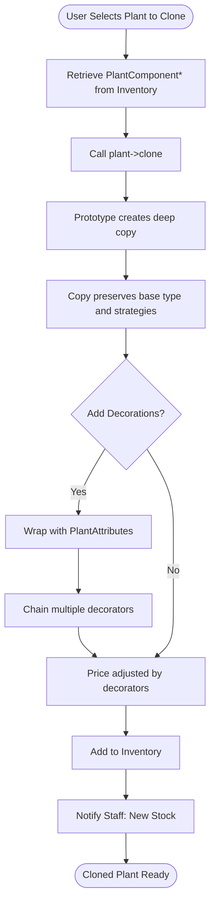
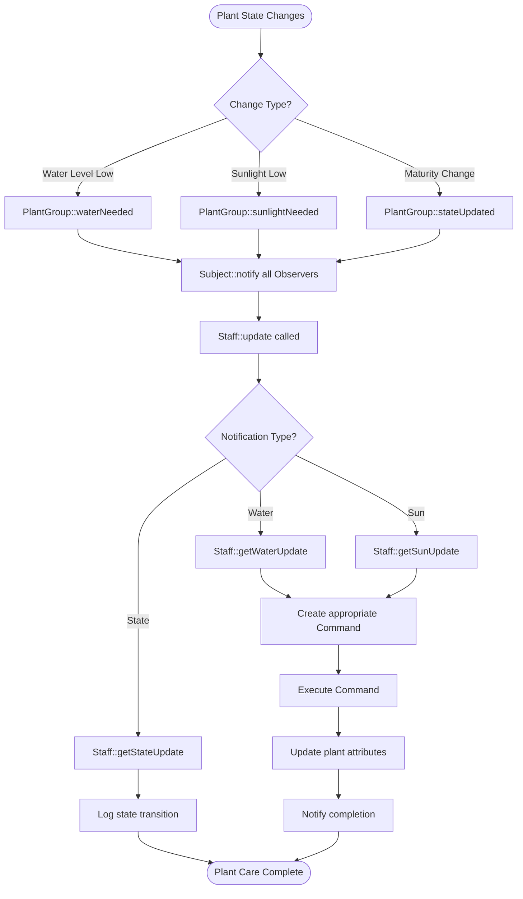
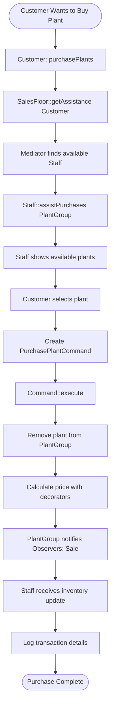
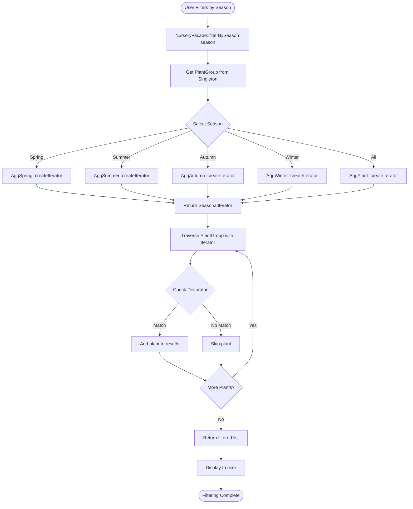
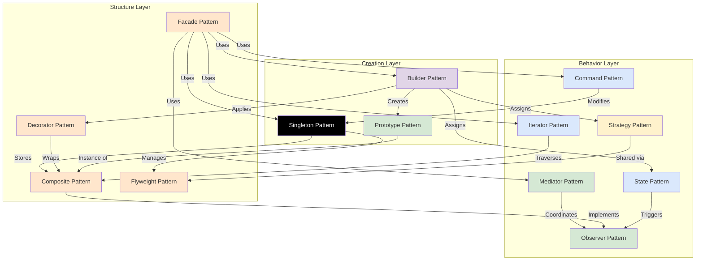

# Photosyntech System Architecture

> **Version:** 1.0
> **Last Updated:** 2025-10-17
> **Implementation Location:** Pattern-based directories at project root (`builder/`, `command/`, `composite/`, etc.)

## Table of Contents
1. [System Overview](#system-overview)
2. [Subsystem Architecture](#subsystem-architecture)
3. [Class Reference by Subsystem](#class-reference-by-subsystem)
4. [Memory Management Strategy](#memory-management-strategy)
5. [Key Workflows](#key-workflows)
6. [Pattern Interactions](#pattern-interactions)

---

## System Overview

### High-Level Architecture

The Photosyntech system is a plant nursery management system that simulates plant lifecycle, inventory management, staff operations, and customer interactions. The architecture is organized into five primary subsystems:

```
┌───────────────────────────────────────────────────────┐
│          System Interface Layer                       │
│        (Facade + Command + GUI)                       │
└───────────────────────────────────────────────────────┘
                        |
        ┌───────────────┼───────────────┐
        |               |               |
        v               v               v
  +-----------+  +----------+  +------------+  +---------+
  |Greenhouse |  |Inventory |  |Sales Floor |  | Staff   |
  |& Plant    |  |Management|  |            |  |Mgmt     |
  |Mgmt       |  |          |  |            |  |         |
  +-----------+  +----------+  +------------+  +---------+
        |               |               |            |
        └───────────────┴───────────────┴────────────┘
                        |
                        v
┌───────────────────────────────────────────────────────┐
│     Shared Services (Singleton + Flyweight)           │
└───────────────────────────────────────────────────────┘
```

### Core Design Principles
- **Modularity**: Clear separation between subsystems with defined interfaces
- **Extensibility**: New plant types, strategies, and states can be added with minimal changes
- **Memory Efficiency**: Shared immutable objects reduce memory footprint
- **Decoupling**: Patterns like Mediator and Observer minimize direct dependencies
- **Interface Abstraction**: Facade provides unified access for multiple UI types

---

## Subsystem Architecture

### 1. Greenhouse & Plant Management Subsystem

**Purpose**: Handles plant creation, configuration, lifecycle management, and care strategies.

**Design Patterns Used**:
- **Builder**: Constructs complex plant species from base types and decorators
- **Prototype**: Enables cloning of plant types
- **State**: Manages plant maturity lifecycle (Seed → Vegetative → Mature → Dead)
- **Strategy**: Defines watering and sunlight care approaches
- **Decorator**: Adds customizations to plants (pots, charms, seasonal attributes)

**Key Classes**:
- `Director`: Orchestrates plant construction
- `Builder` (abstract), `SunflowerBuilder`, `RoseBuilder`, `Plant3Builder`: Concrete builders
- `PlantComponent` (abstract): Base component for Composite pattern
- `LivingPlant` (abstract): Base class for all plant types
- `Succulent`, `Shrub`, `Tree`, `Herb`: Concrete plant types (prototypes)
- `MaturityState` (abstract), `Seed`, `Vegetative`, `Mature`, `Dead`: State hierarchy
- `WaterStrategy` (abstract), `LowWater`, `MidWater`, `HighWater`, `AlternatingWater`: Watering strategies
- `SunStrategy` (abstract), `LowSun`, `MidSun`, `HighSun`: Sunlight strategies
- `PlantAttributes` (abstract): Base decorator
- Decorators: `RedPot`, `LargePot`, `PlantCharm`, `ShopThemedCharm`, `SmallFlowers`, `LargeFlowers`, `SmallStem`, `LargeStem`, `SmallLeaf`, `LargeLeaf`, `Summer`, `Winter`, `Autumn`, `Spring`

**Relationships**:
- Builder creates LivingPlant instances and applies decorators
- LivingPlant aggregates MaturityState, WaterStrategy, and SunStrategy
- Decorator wraps PlantComponent to add features
- State pattern controls lifecycle transitions

---

### 2. Inventory Management Subsystem

**Purpose**: Manages plant collections, tracks inventory, and provides filtering capabilities.

**Design Patterns Used**:
- **Singleton**: Ensures single global inventory instance
- **Composite**: Organizes plants into hierarchical groups
- **Observer**: Notifies stakeholders of inventory changes
- **Iterator**: Enables traversal and filtering by season
- **Flyweight**: Shares immutable data across plant instances

**Key Classes**:
- `Singleton`: Global access point for inventory and shared resources
- `PlantGroup`: Composite container for plants, implements Subject
- `PlantComponent`: Component interface for individual plants and groups
- `FlyweightFactory<T, ID>`: Manages pools of shared objects
- `Flyweight<T>`: Wrapper for shared immutable data
- `Aggregate` (abstract): Iterator factory interface
- `AggPlant`, `AggSpring`, `AggSummer`, `AggAutumn`, `AggWinter`: Concrete aggregates
- `Iterator` (abstract): Iterator interface
- `PlantIterator`, `SpringIterator`, `SummerIterator`, `AutumnIterator`, `WinterIterator`: Concrete iterators

**Relationships**:
- Singleton holds PlantGroup (inventory) and FlyweightFactory instances
- PlantGroup contains PlantComponents (Composite pattern)
- FlyweightFactory creates and caches Flyweight objects
- Aggregate creates Iterators for PlantGroup traversal
- PlantGroup extends Subject for Observer notifications

---

### 3. Sales Floor Subsystem

**Purpose**: Coordinates customer-staff interactions, plant customization, and sales transactions.

**Design Patterns Used**:
- **Mediator**: Coordinates communication between customers and staff
- **Decorator**: Enables plant customization before sale
- **Observer**: Notifies inventory changes on sales

**Key Classes**:
- `Mediator` (abstract): Coordination interface
- `SalesFloor`: Mediates purchase transactions
- `SuggestionFloor`: Mediates plant recommendation requests
- `User` (abstract): Base class for customers and staff
- `Customer`: Initiates purchases and requests suggestions
- `Staff`: Responds to customer requests (extends User, implements Observer)

**Relationships**:
- Mediator maintains lists of Users and Staff
- Customer and Staff communicate through Mediator
- Staff observes PlantGroup for inventory awareness
- Sales trigger Observer notifications

---

### 4. Staff Management Subsystem

**Purpose**: Manages staff operations, plant monitoring, and care action execution.

**Design Patterns Used**:
- **Observer**: Staff monitors assigned plants for state changes
- **Command**: Encapsulates staff actions for undo/redo functionality
- **Mediator**: Coordinates staff-customer interactions

**Key Classes**:
- `Staff`: Implements Observer, extends User
- `Subject` (abstract): Observable interface for plants
- `Observer` (interface): Observer interface for staff
- `Command` (abstract): Action interface
- `WaterPlantCommand`, `AddToInventoryCommand`, `BrowsePlantsCommand`, `PurchasePlantCommand`: Concrete commands

**Relationships**:
- Staff observes PlantGroup (Subject)
- Staff receives notifications on plant state changes (water needs, sunlight needs, maturity transitions)
- Commands encapsulate multi-step operations
- Staff participates in Mediator coordination

---

### 5. System Interface Subsystem

**Purpose**: Provides unified interface for GUI/CLI access to system functionality.

**Design Patterns Used**:
- **Facade**: Simplifies complex subsystem interactions
- **Command**: Handles complex user operations

**Key Classes**:
- `NurseryFacade`: Unified system interface
- `GUI`: User interface implementation (uses Facade)
- `Command` hierarchy: Encapsulates user actions

**Relationships**:
- NurseryFacade aggregates Director, Singleton, Mediators
- NurseryFacade maintains command queue for undo/redo
- GUI calls Facade methods (one per button/menu option)
- Facade coordinates multiple subsystems transparently

---

## Class Reference by Subsystem

### Greenhouse & Plant Management

#### Builder Pattern Classes

| Class | Type | Responsibility | Key Methods | File Location |
|-------|------|----------------|-------------|---------------|
| `Director` | Coordinator | Orchestrates plant construction | `construct()`, `getPlant()` | `Director.h/cpp` |
| `Builder` | Abstract | Builder interface | `createObject()`, `assignWaterStrategy()`, `assignSunStrategy()`, `assignMaturityState()`, `getResult()` | `Builder.h/cpp` |
| `SunflowerBuilder` | Concrete | Builds Sunflower species | Implements Builder methods | `SunflowerBuilder.h/cpp` |
| `RoseBuilder` | Concrete | Builds Rose species | Implements Builder methods | `RoseBuilder.h/cpp` |
| `Plant3Builder` | Concrete | Builds generic plant species | Implements Builder methods | `Plant3Builder.h/cpp` |

**Relationships**: Director → Builder → Plant creation

---

#### Plant Hierarchy (Prototype)

| Class | Type | Responsibility | Key Attributes | File Location |
|-------|------|----------------|----------------|---------------|
| `PlantComponent` | Abstract | Component interface | - | `PlantComponent.h/cpp` |
| `LivingPlant` | Abstract | Base plant with strategies | `_age`, `_health`, `_waterLevel`, `_sunExposure`, `_maturityState`, `_waterStrategy`, `_sunStrategy` | `LivingPlant.h/cpp` |
| `Succulent` | Concrete | Drought-resistant plant type | Inherits LivingPlant | `Succulent.h/cpp` |
| `Shrub` | Concrete | Medium-sized plant type | Inherits LivingPlant | `Shrub.h/cpp` |
| `Tree` | Concrete | Large plant type | Inherits LivingPlant | `Tree.h/cpp` |
| `Herb` | Concrete | Small, fast-growing type | Inherits LivingPlant | `Herb.h/cpp` |

**Relationships**: PlantComponent ← LivingPlant ← {Succulent, Shrub, Tree, Herb}

---

#### State Pattern Classes

| Class | Type | Responsibility | Key Attributes | File Location |
|-------|------|----------------|----------------|---------------|
| `MaturityState` | Abstract | Lifecycle state interface | `_growthRate`, `_minAge`, `_maxAge` | `MaturityState.h/cpp` |
| `Seed` | Concrete | Initial growth state | State-specific growth logic | `Seed.h/cpp` |
| `Vegetative` | Concrete | Active growth state | State-specific growth logic | `Vegetative.h/cpp` |
| `Mature` | Concrete | Full maturity state | State-specific growth logic | `Mature.h/cpp` |
| `Dead` | Concrete | End-of-life state | State-specific growth logic | `Dead.h/cpp` |

**Relationships**: LivingPlant → MaturityState (context holds state reference)

---

#### Strategy Pattern Classes

| Class | Type | Responsibility | Key Attributes | File Location |
|-------|------|----------------|----------------|---------------|
| `WaterStrategy` | Abstract | Watering approach interface | `_waterAmount` | `WaterStrategy.h/cpp` |
| `LowWater` | Concrete | Minimal watering | Implements `water()` | `LowWater.h/cpp` |
| `MidWater` | Concrete | Moderate watering | Implements `water()` | `MidWater.h/cpp` |
| `HighWater` | Concrete | Heavy watering | Implements `water()` | `HighWater.h/cpp` |
| `AlternatingWater` | Concrete | Variable watering | Implements `water()` | `AlternatingWater.h/cpp` |
| `SunStrategy` | Abstract | Sunlight approach interface | `_hoursNeeded`, `_intensity` | `SunStrategy.h/cpp` |
| `LowSun` | Concrete | Shade plant | Implements `addSun()` | `LowSun.h/cpp` |
| `MidSun` | Concrete | Partial sun | Implements `addSun()` | `MidSun.h/cpp` |
| `HighSun` | Concrete | Full sun | Implements `addSun()` | `HighSun.h/cpp` |

**Relationships**: LivingPlant → {WaterStrategy, SunStrategy} (context holds strategy references)

---

#### Decorator Pattern Classes

| Class | Type | Responsibility | Key Methods | File Location |
|-------|------|----------------|-------------|---------------|
| `PlantAttributes` | Abstract | Decorator base | `affectSunlight()`, `affectWater()`, `getInfo()`, `getPrice()` | `PlantAttributes.h/cpp` |
| `RedPot` | Concrete | Red pot decoration | Modifies appearance/price | `RedPot.h/cpp` |
| `LargePot` | Concrete | Large pot decoration | Modifies water retention | `LargePot.h/cpp` |
| `PlantCharm` | Concrete | Charm decoration | Adds aesthetic value | `PlantCharm.h/cpp` |
| `ShopThemedCharm` | Concrete | Branded charm | Adds premium value | `ShopThemedCharm.h/cpp` |
| `SmallFlowers` | Concrete | Small flower decoration | Visual enhancement | `SmallFlowers.h/cpp` |
| `LargeFlowers` | Concrete | Large flower decoration | Visual enhancement | `LargeFlowers.h/cpp` |
| `SmallStem` | Concrete | Small stem decoration | Size modifier | `SmallStem.h/cpp` |
| `LargeStem` | Concrete | Large stem decoration | Size modifier | `LargeStem.h/cpp` |
| `SmallLeaf` | Concrete | Small leaf decoration | Size modifier | `SmallLeaf.h/cpp` |
| `LargeLeaf` | Concrete | Large leaf decoration | Size modifier | `LargeLeaf.h/cpp` |
| `Summer` | Concrete | Summer seasonal marker | Seasonal categorization | `Summer.h/cpp` |
| `Winter` | Concrete | Winter seasonal marker | Seasonal categorization | `Winter.h/cpp` |
| `Autumn` | Concrete | Autumn seasonal marker | Seasonal categorization | `Autumn.h/cpp` |
| `Spring` | Concrete | Spring seasonal marker | Seasonal categorization | `Spring.h/cpp` |

**Relationships**: PlantAttributes wraps PlantComponent, decorators chain together

---

### Inventory Management

#### Singleton & Flyweight

| Class | Type | Responsibility | Key Methods | File Location |
|-------|------|----------------|-------------|---------------|
| `Singleton` | Singleton | Global access point | `getInstance()`, `getInventory()`, `getSeason()`, `getWaterFly()`, `getSunFly()` | `Singleton.h/cpp` |
| `FlyweightFactory<T, ID>` | Factory | Manages shared object pools | `getFlyweight(ID)` | `FlyweightFactory.h` |
| `Flyweight<T>` | Wrapper | Holds shared immutable data | `getState()` | `Flyweight.h` |

**Relationships**: Singleton → FlyweightFactory → Flyweight

---

#### Composite Pattern

| Class | Type | Responsibility | Key Methods | File Location |
|-------|------|----------------|-------------|---------------|
| `PlantComponent` | Abstract | Component interface | `clone()`, `water()`, `setOutside()`, `getInfo()`, `getPrice()` | `PlantComponent.h/cpp` |
| `PlantGroup` | Composite | Container for plants | `add()`, `remove()`, `getChild()`, implements Subject methods | `PlantGroup.h/cpp` |

**Relationships**: PlantGroup contains list of PlantComponent

---

#### Iterator Pattern

| Class | Type | Responsibility | Key Methods | File Location |
|-------|------|----------------|-------------|---------------|
| `Aggregate` | Abstract | Iterator factory | `createIterator(list<PlantComponent*>)` | `Aggregate.h/cpp` |
| `AggPlant` | Concrete | Creates general iterator | `createIterator()` | `AggPlant.h/cpp` |
| `AggSpring` | Concrete | Creates spring filter iterator | `createIterator()` | `AggSpring.h/cpp` |
| `AggSummer` | Concrete | Creates summer filter iterator | `createIterator()` | `AggSummer.h/cpp` |
| `AggAutumn` | Concrete | Creates autumn filter iterator | `createIterator()` | `AggAutumn.h/cpp` |
| `AggWinter` | Concrete | Creates winter filter iterator | `createIterator()` | `AggWinter.h/cpp` |
| `Iterator` | Abstract | Traversal interface | `first()`, `next()`, `isDone()`, `currentItem()` | `Iterator.h/cpp` |
| `PlantIterator` | Concrete | Traverses all plants | Implements Iterator | `PlantIterator.h/cpp` |
| `SpringIterator` | Concrete | Filters spring plants | Implements Iterator | `SpringIterator.h/cpp` |
| `SummerIterator` | Concrete | Filters summer plants | Implements Iterator | `SummerIterator.h/cpp` |
| `AutumnIterator` | Concrete | Filters autumn plants | Implements Iterator | `AutumnIterator.h/cpp` |
| `WinterIterator` | Concrete | Filters winter plants | Implements Iterator | `WinterIterator.h/cpp` |

**Relationships**: Aggregate → Iterator, Iterator traverses PlantGroup

---

### Sales Floor & Staff Management

#### Observer Pattern

| Class | Type | Responsibility | Key Methods | File Location |
|-------|------|----------------|-------------|---------------|
| `Subject` | Abstract | Observable interface | `attach()`, `detach()`, `waterNeeded()`, `sunlightNeeded()`, `stateUpdated()` | `Subject.h/cpp` |
| `Observer` | Interface | Observer interface | `update()`, `getWaterUpdate()`, `getSunUpdate()`, `getStateUpdate()` | `Observer.h/cpp` |
| `Staff` | Concrete | Monitors plants, assists customers | Implements Observer methods, extends User | `Staff.h/cpp` |

**Relationships**: PlantGroup extends Subject, Staff implements Observer

---

#### Mediator Pattern

| Class | Type | Responsibility | Key Methods | File Location |
|-------|------|----------------|-------------|---------------|
| `Mediator` | Abstract | Coordination interface | `getAssistance(User*)`, `assist()` | `Mediator.h/cpp` |
| `SalesFloor` | Concrete | Mediates purchase transactions | `getAssistance()` | `SalesFloor.h/cpp` |
| `SuggestionFloor` | Concrete | Mediates plant suggestions | `getAssistance()` | `SuggestionFloor.h/cpp` |
| `User` | Abstract | Base for customers/staff | Holds mediator references | `User.h/cpp` |
| `Customer` | Concrete | Initiates requests | `askForSuggestion()`, `purchasePlants()` | `Customer.h/cpp` |

**Relationships**: Mediator ↔ {Customer, Staff}, Customer/Staff extend User

---

#### Command Pattern

| Class | Type | Responsibility | Key Methods | File Location |
|-------|------|----------------|-------------|---------------|
| `Command` | Abstract | Action interface | `execute()`, `undo()` | `Command.h/cpp` |
| `AddToInventoryCommand` | Concrete | Adds plants to inventory | `execute()`, `undo()` | `AddToInventoryCommand.h/cpp` |
| `BrowsePlantsCommand` | Concrete | Displays inventory | `execute()`, `undo()` | `BrowsePlantsCommand.h/cpp` |
| `WaterPlantCommand` | Concrete | Waters selected plants | `execute()`, `undo()` | `WaterPlantCommand.h/cpp` |
| `PurchasePlantCommand` | Concrete | Processes plant purchase | `execute()`, `undo()` | `PurchasePlantCommand.h/cpp` |

**Relationships**: NurseryFacade → Command queue

---

### System Interface

#### Facade Pattern

| Class | Type | Responsibility | Key Methods | File Location |
|-------|------|----------------|-------------|---------------|
| `NurseryFacade` | Facade | Unified system interface | `createPlant()`, `displayInventory()`, `processSale()`, `executeCommand()`, `undoLastCommand()`, `filterBySeason()` | `NurseryFacade.h/cpp` |
| `GUI` | Interface | User interface | `displayMenu()`, `handleUserInput()`, `run()` | `GUI.h/cpp` |

**Relationships**: GUI → NurseryFacade → {Director, Singleton, Mediator, Command}

---

## Memory Management Strategy

### Overview
The system employs strategic memory optimization to support large-scale plant inventories (up to 5,000 instances) without performance degradation.

### Flyweight Pattern Implementation

**Shared Immutable Data**:
- **Season Names**: "Spring", "Summer", "Autumn", "Winter" (4 objects total, reused across all plants)
- **WaterStrategy Instances**: LowWater, MidWater, HighWater, AlternatingWater (4 objects total)
- **SunStrategy Instances**: LowSun, MidSun, HighSun (3 objects total)

**Memory Savings Calculation**:
```
Without Flyweight (5,000 plants):
- 5,000 season strings = ~100KB
- 5,000 WaterStrategy objects = ~200KB
- 5,000 SunStrategy objects = ~150KB
Total: ~450KB

With Flyweight (5,000 plants):
- 4 season strings = ~80 bytes
- 4 WaterStrategy objects = ~160 bytes
- 3 SunStrategy objects = ~120 bytes
Total: ~360 bytes

Memory Saved: ~449.6KB (99.92% reduction for shared data)
```

**Implementation Details**:
```cpp
// Singleton manages FlyweightFactory instances
class Singleton {
private:
    FlyweightFactory<string, string>* _string;
    FlyweightFactory<int, WaterStrategy>* _waterStrategies;
    FlyweightFactory<int, SunStrategy>* _sunStrategies;

public:
    Flyweight<string>* getSeason(string aSeason);
    Flyweight<WaterStrategy>* getWaterFly(int level);
    Flyweight<SunStrategy>* getSunFly(int level);
};

// FlyweightFactory caches objects by ID
template<typename T, typename ID>
class FlyweightFactory {
private:
    map<ID, Flyweight<T>*> _cache;

public:
    Flyweight<T>* getFlyweight(ID key) {
        if (_cache.find(key) == _cache.end()) {
            _cache[key] = new Flyweight<T>(/* create new */);
        }
        return _cache[key];
    }
};
```

**Access Pattern**:
1. LivingPlant requests strategy via Singleton: `Singleton::getInstance()->getWaterFly(LEVEL_MID)`
2. Singleton delegates to FlyweightFactory
3. Factory returns cached instance or creates new one
4. LivingPlant stores pointer to shared Flyweight

### Singleton Pattern Implementation

**Purpose**: Ensures single instance of inventory and flyweight factories.

**Lifecycle**:
1. **Initialization**: First call to `Singleton::getInstance()` creates instance
2. **Runtime**: All subsystems access same inventory via Singleton
3. **Cleanup**: Singleton responsible for deleting inventory and factories on program exit

**Thread Safety**: Current implementation is single-threaded; multi-threading would require mutex protection on `getInstance()`.

---

## Key Workflows

### Workflow 1: Creating a Plant Species



**Key Classes Involved**:
- NurseryFacade, Director, Builder (SunflowerBuilder/RoseBuilder/Plant3Builder)
- Shrub/Tree/Succulent/Herb (base types)
- PlantAttributes decorators
- Singleton → FlyweightFactory → WaterStrategy/SunStrategy
- Seed (initial state)
- PlantGroup (inventory), Subject/Observer (notifications)

---

### Workflow 2: Cloning and Decorating a Plant



**Key Classes Involved**:
- PlantComponent::clone()
- LivingPlant subclasses (Succulent, Shrub, Tree, Herb)
- PlantAttributes and concrete decorators
- PlantGroup (inventory)
- Subject/Observer (notifications)

---

### Workflow 3: Staff Monitoring and Plant Care



**Key Classes Involved**:
- PlantGroup (Subject)
- Staff (Observer)
- MaturityState (triggers state notifications)
- WaterStrategy/SunStrategy (determine needs)
- Command hierarchy (WaterPlantCommand)

---

### Workflow 4: Customer Purchase Transaction



**Key Classes Involved**:
- Customer, Staff, SalesFloor (Mediator)
- PlantGroup (inventory)
- PurchasePlantCommand
- PlantComponent::getPrice() (includes decorator pricing)
- Subject/Observer (inventory notifications)

---

### Workflow 5: Seasonal Plant Filtering



**Key Classes Involved**:
- NurseryFacade
- Singleton (inventory access)
- PlantGroup
- Aggregate hierarchy (AggSpring, AggSummer, AggAutumn, AggWinter, AggPlant)
- Iterator hierarchy (SpringIterator, SummerIterator, etc.)
- Seasonal decorators (Spring, Summer, Autumn, Winter)

---

## Pattern Interactions

### Pattern Collaboration Map



### Key Pattern Interactions

#### 1. Builder → Prototype → Decorator
**Flow**: Builder creates plant species by cloning a prototype and applying decorators.

**Example**: Creating a Rose
```
Director → RoseBuilder
  → Clone Shrub prototype
  → Wrap with LargeFlowers decorator
  → Wrap with Summer decorator
  → Wrap with RedPot decorator
  → Assign strategies and state
  → Return decorated plant
```

#### 2. Singleton → Flyweight → Strategy
**Flow**: Singleton manages Flyweight factories that provide shared strategy instances.

**Example**: Assigning water strategy
```
LivingPlant needs MidWater strategy
  → Calls Singleton::getInstance()->getWaterFly(LEVEL_MID)
  → Singleton delegates to FlyweightFactory<WaterStrategy>
  → Factory returns cached MidWater instance
  → Plant stores pointer to shared object
```

#### 3. State → Observer → Staff
**Flow**: State changes trigger observer notifications to monitoring staff.

**Example**: Plant matures
```
LivingPlant::grow() called
  → MaturityState::grow() checks age
  → State transitions: Vegetative → Mature
  → LivingPlant updates _maturityState
  → Calls PlantGroup::stateUpdated()
  → PlantGroup notifies all attached Observers
  → Staff::getStateUpdate() receives notification
  → Staff logs maturity change
```

#### 4. Facade → Multiple Patterns
**Flow**: Facade coordinates multiple patterns to fulfill user requests.

**Example**: User clicks "Create Rose" button
```
GUI calls NurseryFacade::createPlant("Rose")
  → Facade uses Director + RoseBuilder (Builder pattern)
  → Facade accesses Singleton::getInventory() (Singleton pattern)
  → Facade adds plant to inventory (Composite pattern)
  → Inventory notifies observers (Observer pattern)
  → Returns success to GUI
```

#### 5. Command → Undo/Redo Chain
**Flow**: Command pattern enables reversible operations.

**Example**: Undo plant purchase
```
User purchases plant
  → GUI calls Facade::executeCommand(new PurchasePlantCommand(...))
  → Command::execute() removes plant from inventory
  → Facade stores command in command queue

User wants to undo
  → GUI calls Facade::undoLastCommand()
  → Facade pops last command from queue
  → Command::undo() re-adds plant to inventory
  → Inventory notifies observers
```

#### 6. Iterator → Composite Traversal
**Flow**: Iterator pattern provides filtered access to composite structure.

**Example**: Filter summer plants
```
User selects "Summer" filter
  → Facade calls filterBySeason("Summer")
  → Creates AggSummer instance
  → Calls AggSummer::createIterator(inventoryPlants)
  → Returns SummerIterator
  → Iterator traverses PlantGroup, checking for Summer decorator
  → Returns matching plants
```

---

## Extension Points

### Adding New Plant Types (Prototype)
**Location**: `LivingPlant` hierarchy
**Steps**:
1. Create new concrete class extending `LivingPlant`
2. Implement `clone()` method
3. No changes to existing code required

**Example**:
```cpp
class Cactus : public LivingPlant {
public:
    PlantComponent* clone() override {
        return new Cactus(*this);
    }
};
```

### Adding New Care Strategies (Strategy)
**Location**: `WaterStrategy` or `SunStrategy` hierarchy
**Steps**:
1. Create new concrete strategy class
2. Add to FlyweightFactory initialization in Singleton
3. Update Builder if needed for default assignment

**Example**:
```cpp
class DroughtResistantWater : public WaterStrategy {
public:
    int water() override {
        // Minimal water implementation
        return _waterAmount / 2;
    }
};
```

### Adding New Maturity States (State)
**Location**: `MaturityState` hierarchy
**Steps**:
1. Create new concrete state class
2. Update transition logic in adjacent states
3. Maximum 2 file modifications (new state + one adjacent state)

### Adding New Decorations (Decorator)
**Location**: `PlantAttributes` hierarchy
**Steps**:
1. Create new decorator extending `PlantAttributes`
2. Implement price/info modifications
3. No changes to existing decorators

### Adding New Commands (Command)
**Location**: `Command` hierarchy
**Steps**:
1. Create new command class implementing `execute()` and `undo()`
2. Add to Facade if needed for menu access
3. Command automatically supports undo/redo

---

## Performance Considerations

### Time Complexity

| Operation | Complexity | Notes |
|-----------|------------|-------|
| Plant Creation | O(1) | Direct instantiation + decorator chaining |
| Plant Cloning | O(d) | d = number of decorators |
| Add to Inventory | O(1) | PlantGroup uses list |
| Observer Notification | O(n) | n = number of observers |
| Iterator Traversal | O(m) | m = number of plants |
| Seasonal Filtering | O(m) | Must check each plant |
| Flyweight Lookup | O(1) | Map-based cache |

### Space Complexity

| Component | Space | Notes |
|-----------|-------|-------|
| LivingPlant | ~200 bytes | Without shared data |
| Decorator | ~50 bytes | Per decorator applied |
| Shared Strategies | ~40 bytes | Total for all instances via Flyweight |
| PlantGroup | O(n) | n = number of plants stored |
| Observer List | O(o) | o = number of observers |

### Scalability Targets
- **10,000 plants**: Care routines complete in one simulation cycle
- **5,000 plants**: No memory exhaustion or performance degradation
- **Sub-linear memory growth**: Flyweight reduces per-plant memory footprint

---

## Summary

The Photosyntech architecture achieves:

✅ **Modularity**: Five clear subsystems with defined responsibilities
✅ **Extensibility**: New types, strategies, and states added with ≤2 file modifications
✅ **Memory Efficiency**: Flyweight pattern reduces memory by 99.92% for shared data
 **Loose Coupling**: Mediator and Observer minimize dependencies
 **Interface Abstraction**: Facade enables GUI/CLI without code duplication
 **Maintainability**: Clear pattern boundaries and single-responsibility classes

The system supports large-scale simulations (10,000+ plants) while maintaining clean architecture and extensibility for future enhancements.

---

**For pattern-specific implementation details, see individual pattern documentation in `docs/design-patterns/`.**
