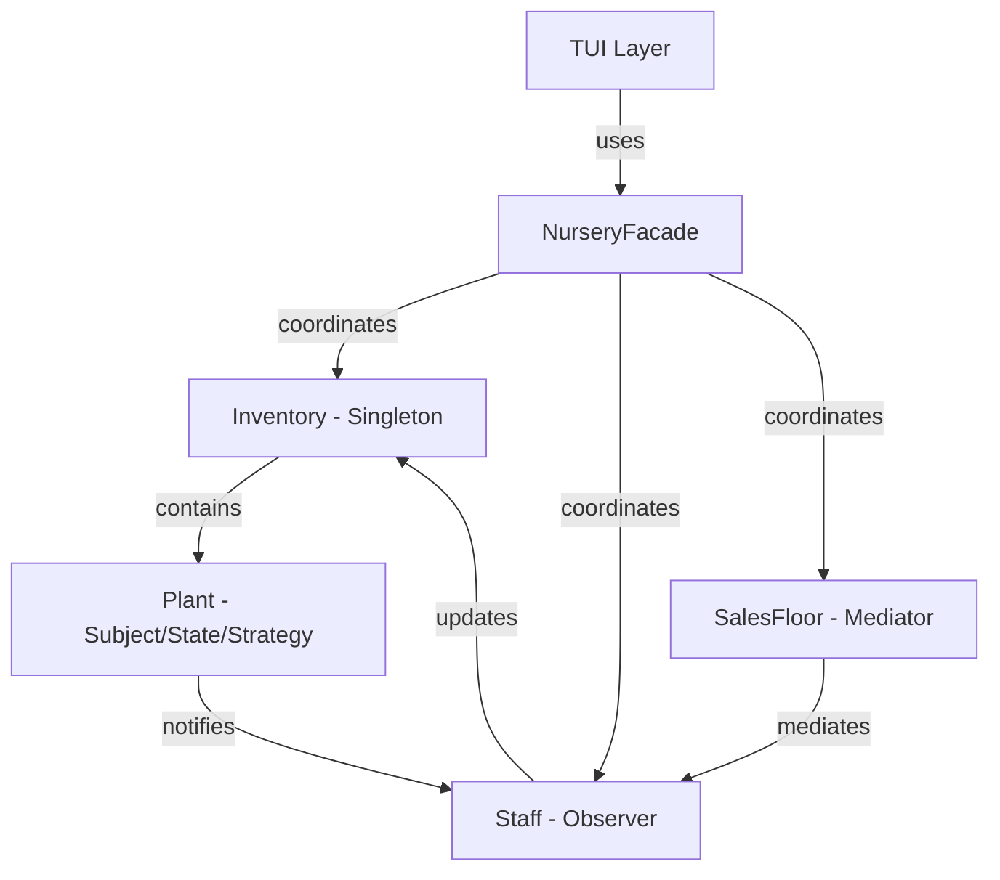

**Team Name:** Photosyntech  
**Project:** COS214 Final Project - Plant Nursery Simulator  
**Date:** October 2025  
**Version:** 1.0 (Draft)

---

## Table of Contents

1. Executive Summary
2. System Overview
3. Functional Requirements
4. Non-Functional Requirements
5. Design Patterns
6. System Architecture
7. Class Relationships
8. Future Extensibility

---

## 1. Executive Summary

The Photosyntech Plant Nursery Simulator is a C++ application designed to model the operations of a working plant nursery. The system encompasses three primary domains: greenhouse/garden operations, staff management, and customer interactions on the sales floor.

The design leverages **10+ design patterns** to ensure flexibility, maintainability, and scalability. Each pattern addresses specific design challenges while maintaining loose coupling and high cohesion across the system.

**Key Statistics:**

- **Design Patterns:** 11 (exceeds minimum requirement of 10)
- **Creational Patterns:** 4
- **Behavioral Patterns:** 5
- **Structural Patterns:** 2
- **Functional Requirements:** 15+
- **Non-Functional Requirements:** 3

---

## 2. System Overview

### 2.1 System Purpose

The Plant Nursery Simulator models:

- **Plant lifecycle management** from seed to mature sale-ready plants
- **Staff operations** including plant care, monitoring, and customer assistance
- **Customer interactions** including browsing, customization, and purchasing
- **Inventory tracking** across all system states

### 2.2 Primary Subsystems

#### **Greenhouse/Garden Area**

- Plant creation and growth
- Plant care management (watering, sunlight, fertilizer)
- Lifecycle state transitions
- Stock management

#### **Staff Management**

- Plant care execution
- Health and lifecycle monitoring
- Inventory coordination
- Customer assistance

#### **Sales Floor & Customers**

- Customer browsing and information requests
- Plant customization options
- Purchase transactions
- Staff-customer mediation

---

## 3. Functional Requirements
## 3. Functional Requirements

### 3.1 Greenhouse/Garden Subsystem

**FR1: Plant Construction with Builder**  
The system will provide builder classes that create plants with specific configurations such as water strategy, sun strategy and maturity state. A Director will coordinate the construction of custom plants, ensuring all required attributes are initialized.  
_Pattern: Builder_

**FR2: Plant Cloning**  
Cloning will allow new instances of plants to be created with copied attributes through the clone() method. This is used to efficiently recreate very specific versions of plants multiple times.  
_Pattern: Prototype_

**FR3: Dynamic Watering Strategy**  
Different watering strategies will be implemented that define the water amount and frequency for different types of plants. Watering strategies will change based on the lifecycle of the plant.  
_Pattern: Strategy_

**FR4: Dynamic Sun Strategy**  
Different sun strategies will be implemented that define the intensity and hours of sun needed for different types of plants.  
_Pattern: Strategy_

**FR5: Plant Lifecycle States**  
The system will manage maturity states, which specify minimum ages, growth rates and price increases/decreases. Automatic transitions between states based on the age of the plant will be implemented.  
_Pattern: State_

**FR6: Inventory Structure**  
Plants will be organised into a structure using Composite, where these structures can be individual plants or groups of plants. The system will implement operations that traverse through the structure and get the total amount of the contained plants. Plants will be grouped by categories but will ensure that individual plants will be handled in the same manner.  
_Pattern: Composite_

**FR7: Inventory Singleton**  
A single global inventory will be shared to ensure that customers and staff access the same inventory. The creation of multiple inventories will be prohibited.  
_Pattern: Singleton_

### 3.2 Staff Subsystem

**FR8: Plant State Monitoring**  
Staff members will observe assigned plants' states to receive notifications about the health changes and lifecycle changes of the observed plant. The system will notify the assigned staff of state changes.  
_Pattern: Observer_

**FR9: Inventory Monitoring**  
Staff will be notified of inventory changes from sales and stock increases and decreases. Multiple staff will be able to observe the same inventory, ensuring awareness of stock levels.  
_Pattern: Observer_

**FR10: Customer Interaction Mediation**  
A mediator will coordinate communication between staff and customers on the sales floor, allowing decoupling of the staff. The mediator will broadcast necessary inventory updates to customers and staff on the sales floor.  
_Pattern: Mediator_

### 3.3 Customer & Sales Floor Subsystem

**FR11: Plant Customization**  
Plants will be customisable, such as adding a charm or decorating the pot. Multiple decorators on a single plant will be possible, allowing wrapping on Plant objects. The Plant interface will be maintained such that decorated plants are treated the same as regular plants.  
_Pattern: Decorator_

**FR12: Seasonal Plant Browsing**  
The Iterator will traverse through the Composite Plant structure based on the season the plant is assigned to.  
_Pattern: Iterator_

**FR13: Command-Based Actions**  
Actions such as watering plants, selling plants and hiring/firing staff will be executed through Command objects.  
_Pattern: Command_

### 3.4 Additional Functional Requirements

**FR14: Plant Information Retrieval**  
The system shall provide detailed plant information including care requirements, pricing, and availability.

**FR15: Transaction Processing**  
The system shall process plant purchases, update inventory, and record transaction details.

**FR16: Stock Addition**  
The system shall support easy addition of new plant stock across all seasons and types.

## 4. Non-Functional Requirements
## 4. Non-Functional Requirements (Quality Attributes)

These specifications define how well the system performs, ensuring quality attributes such as performance, maintainability, usability, scalability, and reliability are met.

### 4.1 Performance (NFR1)

**Requirement:** The system must be able to execute all staff care routines for a simulation of up to 10,000 active plants within a single simulated day cycle to ensure smooth progression.  
**Rationale:** Ensures the system can handle large-scale nursery operations without performance degradation.  
**Implementation:** Efficient algorithms, proper data structures, and optimized observer notifications.

### 4.2 Maintainability/Extensibility (NFR2)

**Requirement:** The system must be implemented such that adding a new type of care routine or a new plant species requires modification to only a maximum of two existing classes or files.  
**Rationale:** Open/Closed Principle - open for extension, closed for modification.  
**Implementation:** Pattern-based architecture (Factory, Strategy, Builder) enables easy extension.

### 4.3 Usability (NFR3)

**Requirement:** The system must utilise a clear text/visual based interface where all available actions and input parameters are displayed to the user upon request. A new user without any prior knowledge of the system should be able to navigate the system using only the text based system.  
**Rationale:** Users should not need extensive training to use the system.  
**Implementation:** Intuitive menu system, clear prompts, and comprehensive help documentation.

### 4.4 Scalability (NFR4)

**Requirement:** The system must be able to handle a simulation with an inventory of up to 5,000 unique plant instances without memory exhaustion or a noticeable decrease in simulation speed.  
**Rationale:** Ensures the system scales to larger nursery operations.  
**Implementation:** Efficient memory management, object pooling where appropriate, and optimized data structures.

### 4.5 Reliability (NFR5)

**Requirement:** The whole system must be designed with distinct modules for the staff, greenhouse and customer interactions. This ensures that a change in one area does not break any functionality in any other area.  
**Rationale:** High cohesion, low coupling for system stability.  
**Implementation:** Clear separation of concerns through subsystems, well-defined interfaces, and comprehensive testing.

## 5. Design Patterns

This project utilizes 12 design patterns to ensure a modular, extensible, and maintainable architecture. Each pattern addresses a specific design challenge. For detailed information on each pattern's implementation, please refer to the individual documentation files in the `docs/design-patterns` directory.

### 5.1 Creational Patterns

*   **[Builder](design-patterns/builder.md):** Constructs complex plant objects with various configurations.
*   **[Prototype](design-patterns/prototype.md):** Enables efficient creation of new plant instances by cloning existing ones.
*   **[Singleton](design-patterns/singleton.md):** Ensures a single, globally accessible instance of the inventory and flyweight factories.

### 5.2 Behavioral Patterns

*   **[Command](design-patterns/command.md):** Encapsulates requests as objects, enabling undoable operations and request queuing.
*   **[Iterator](design-patterns/iterator.md):** Provides a way to access the elements of an aggregate object sequentially without exposing its underlying representation.
*   **[Mediator](design-patterns/mediator.md):** Defines an object that encapsulates how a set of objects interact.
*   **[Observer](design-patterns/observer.md):** Defines a one-to-many dependency between objects so that when one object changes state, all its dependents are notified and updated automatically.
*   **[State](design-patterns/state.md):** Allows an object to alter its behavior when its internal state changes.
*   **[Strategy](design-patterns/strategy.md):** Defines a family of algorithms, encapsulates each one, and makes them interchangeable.

### 5.3 Structural Patterns

*   **[Composite](design-patterns/composite.md):** Composes objects into tree structures to represent part-whole hierarchies.
*   **[Decorator](design-patterns/decorator.md):** Attaches additional responsibilities to an object dynamically.
*   **[Facade](design-patterns/facade.md):** Provides a unified interface to a set of interfaces in a subsystem.
*   **[Flyweight](design-patterns/flyweight.md):** Uses sharing to support large numbers of fine-grained objects efficiently.

---

## 6. System Architecture

### 6.1 High-Level Architecture

```
┌─────────────────────────────────────────────────────┐
│                   TUI Layer                         │
│              (FTXUI / TUIController)            │
└──────────────────────┬──────────────────────────────┘
                       │ uses
                       ▼
┌─────────────────────────────────────────────────────┐
│                 Facade Layer                        │
│                (NurseryFacade)                      │
│          [Command Pattern for complex ops]          │
└──────────────────────┬──────────────────────────────┘
                       │ coordinates
                       ▼
┌─────────────────────────────────────────────────────┐
│              Business Logic Layer                   │
│  ┌──────────────┬───────────────┬─────────────┐     │
│  │  Greenhouse  │     Staff     │   Sales     │     │
│  │  Subsystem   │   Subsystem   │  Subsystem  │     │
│  └──────────────┴───────────────┴─────────────┘     │
│                                                     │
│  [Abstract Factory, Prototype, Strategy, State,     │
│   Observer, Mediator, Composite, Decorator]         │
└─────────────────────────────────────────────────────┘
```

### 6.2 Pattern Integration Map

**Creation Flow:**

```
Abstract Factory → creates → Concrete Plants
                             ↓
                        Prototype (cloning)
                             ↓
                        Composite (grouping)
                             ↓
                        Singleton Inventory
```

**Behavior Flow:**

```
Plant State changes → Observer → Staff notified
                                   ↓
Plant needs care ← Strategy ← Staff executes
                                   ↓
Customer interaction ← Mediator → Staff assists
                                   ↓
Purchase ← Decorator → Customized plant
```

**Interface Flow:**

```
TUI → Command → Facade → Subsystems
```

### 6.3 Subsystem Communication



---

## 7. Class Relationships

### 7.1 Core Class Hierarchy

```
PlantComponent (Abstract)
└── LivingPlant (Concrete)
    ├── Implements: Prototype (clone)
    ├── Uses: Strategy (WaterStrategy, SunStrategy)
    ├── Uses: State (MaturityState)
    └── Subclasses:
        ├── Succulent
        ├── Shrub
        ├── Tree
        └── Herb
```

### 7.2 Key Associations

- `Builder` ──creates──> `Plant`
- `Plant` ──has──> `WaterStrategy`
- `Plant` ──has──> `SunStrategy`
- `Plant` ──has──> `MaturityState`
- `Plant` ──notifies──> `Staff` (Observer)
- `Inventory` ──contains──> `PlantCollection` (Composite)
- `PlantCollection` ──aggregates──> `Plant`
- `Staff` ──observes──> `Plant`
- `Staff` ──observes──> `Inventory`
- `SalesFloor` ──mediates──> `Staff` & `Customer`
- `PlantDecorator` ──wraps──> `Plant`
- `NurseryFacade` ──uses──> all subsystems
- `Command` ──uses──> `NurseryFacade`

---

## 8. Future Extensibility

### 8.1 Easy to Add

**New Seasons:**

- Seasons are now a string attribute of a plant, managed by the `Builder`. No new classes are needed.

**New Plant Types:**

- New plant types can be added by creating a new subclass of `LivingPlant` and a corresponding builder in the `Builder` directory.

**New Care Strategies:**

- Implement new `ConcreteStrategy` class
- Assign to plants at creation or runtime
- No changes to plant classes

**New Decorations:**

- Create new `ConcreteDecorator`
- Works with all existing plants automatically

**New Staff Roles:**

- Implement `Observer` interface
- Register with subjects
- No changes to plant or inventory classes

---

## Appendix A: Pattern Summary Table

|Pattern|Type|Purpose|FR Mapping|
|---|---|---|---|
|Builder|Creational|Constructs complex plant objects with various configurations.|FR1, FR2|
|Prototype|Creational|Clone plants efficiently|FR3|
|Singleton|Creational|Single inventory instance|FR8|
|Observer|Behavioral|Notify staff of changes|FR9, FR10|
|Strategy|Behavioral|Interchangeable care algorithms|FR4, FR5|
|State|Behavioral|Plant maturity behaviors|FR6|
|Mediator|Behavioral|Coordinate staff-customer|FR11|
|Iterator|Behavioral|Traverse plant collections|FR13|
|Command|Behavioral|Encapsulate GUI operations|FR15|
|Composite|Structural|Organize plant hierarchies|FR7|
|Decorator|Structural|Add plant customizations|FR12|
|Facade|Structural|Simplify GUI interface|FR14|

---

## Appendix B: Design Principles Applied

### SOLID Principles

**Single Responsibility Principle:**

- Each pattern addresses one specific concern
- Classes have single, well-defined responsibilities

**Open/Closed Principle:**

- Open for extension (new seasons, strategies, decorations)
- Closed for modification (existing code unchanged)

**Liskov Substitution Principle:**

- All concrete plants substitutable for abstract Plant
- All concrete strategies substitutable for abstract Strategy

**Interface Segregation Principle:**

- Focused interfaces (Observer, Strategy, State)
- Clients depend only on methods they use

**Dependency Inversion Principle:**

- High-level modules depend on abstractions
- Concrete implementations depend on interfaces

### Additional Principles

**DRY (Don't Repeat Yourself):**

- The Builder pattern centralizes the creation logic for plants, avoiding duplicate creation code.
- Strategy patterns eliminate duplicate care algorithms

**Composition over Inheritance:**

- Decorator uses composition for flexibility
- Strategy uses composition for interchangeable algorithms

**Loose Coupling:**

- Mediator reduces coupling between staff and customers
- Observer allows loose coupling between plants and staff

---

**Document Status:** Final  

---

_End of Design Document_
