## Greenhouse/Garden Area
# Photosyntech - First Meeting Decisions

**Team Name:** Photosyntech  
**Date:** Initial Design Phase  
**Project:** COS214 Plant Nursery Simulator

---

## Project Overview

### Key Requirements
- **Minimum 10 design patterns** (at least 2 of each type: creational, behavioral, structural)
- **Required patterns (must use 5 of these):** Observer, Iterator, Mediator, Command, Adapter, Chain of Responsibility, Builder, Interpreter, Bridge, Facade, Visitor, Proxy, Singleton, Flyweight
- **Team size:** 5-7 members
- **Demo date:** 3-5 November 2025

### System Architecture
Three main interconnected areas:
1. Greenhouse/Garden Area (Plant management)
2. Staff (Bridge between plants and customers)
3. Customers & Sales Floor (Transactions and interactions)

---

#### Plant Care
 - Plants require different care based off type and maturity
	 - Strategy for Sunlight/Water/Fertiliser - Might be Decorator
#### Plant Lifecycle
- The life cycle of a plant differs per plant type. Some grow to maturity much faster than others meaning that plants may be put up for sale at different times.
	- State - Pricing will be based off State
#### Plant Inventory
- There must be an inventory tracking subsystem in place so that staff know what is on hand to sell to the customers. All plants should be accounted for, whether they are ready to sell or still growing to maturity.
	- Singleton - Only one instance of an inventory can exist
	- Observer - Updates Inventory on Changes
	- Composite - Used to group plants together
#### Plant Stock
- Prototype - Plants can be cloned - simulating an order
- Abstract Factory - Seasonal Plants - Factory needs to start at a state - eg. Mature
	- Potentially Factory Method in this
## Staff
#### Plant Care
 - Tend to plants according to their unique care routines (watering, fertilising, sunlight management, pruning, etc.).
#### Plant Life-cycles
- Monitor plant health and life cycles, and take action when plants need extra attention.
	- Observer - Subscribed to State
#### Inventory
- Track inventory and coordinate with other staff to ensure the sales floor reflects what is available in the greenhouse.
	- Observer - Observes inventory
#### Customer Interaction
- Interact with customers by offering advice, answering questions, and helping them find suitable plants.
	- Mediator - Handles staff - customer interaction
## Customer
#### Customer Browsing
- Customers can view available plants, ask for information, or request recommendations.
#### Personalisation
- Customers may want to customise their plants (e.g., decorative pots, gift wrapping, or special arrangements).
	- Decorator - Add to Plant/Composition
#### Interaction with Staff
- They receive guidance, purchase assistance, and updates on availability or stock changes.
	- Mediator
#### Sales and Transactions
- The system should handle plant purchases, updating inventory, and optionally recording transaction details.
	- Builder???
	- Strategy??
## GUI/Interface
#### Facade
 - Used to exclusively interact with DearIamGui
#### Command
 - Used to interact with Facade for complex actions

---

## Design Pattern Summary (From Draft Diagram)

### Confirmed Patterns (9 identified so far)

1. **Factory** (Creational) ✓ REQUIRED
   - Create different plant types
   - ConcreteCreator classes for specific plant categories

2. **Prototype** (Creational)
   - Clone plants for stock management
   - Simulate plant orders

3. **Composite** (Structural)
   - Group plants together in inventory
   - Composite pattern for plant collections

4. **Decorator** (Structural)
   - Plant customizations (pots, gift wrapping)
   - Add features to plants dynamically

5. **Observer** (Behavioral) ✓ REQUIRED
   - Plant state changes notify staff
   - Inventory updates
   - Subject-Observer relationship for plant monitoring

6. **Mediator** (Behavioral) ✓ REQUIRED
   - Staff-Customer interactions
   - SalesFloor as mediator between Staff and Customer
   - Colleague pattern implementation

7. **Strategy** (Behavioral)
   - Different care strategies (water, sun, fertilizer)
   - WaterStrategy, SunStrategy implementations
   - Context: Plant uses different strategies

8. **State** (Behavioral)
   - Plant maturity states (seed, mid, mature, dead)
   - MaturityState with different growth rates
   - State affects pricing and availability

9. **Iterator** (Behavioral) ✓ REQUIRED
   - Aggregate pattern for collections
   - Multiple iterators: PlantIterator, SummerIterator, WinterIterator, etc.
   - Seasonal plant iterations

### Patterns Still Needed (Need 1 more minimum)

**Options from required list:**
- Command ✓ REQUIRED - Already planned for GUI/Facade interaction
- Adapter ✓ REQUIRED
- Chain of Responsibility ✓ REQUIRED
- Builder ✓ REQUIRED
- Interpreter ✓ REQUIRED
- Bridge ✓ REQUIRED
- Facade ✓ REQUIRED - Already planned for GUI
- Visitor ✓ REQUIRED
- Proxy ✓ REQUIRED
- Singleton ✓ REQUIRED - Already planned for Inventory
- Flyweight ✓ REQUIRED

**Suggestions:**
- **Command** - Already in GUI section for complex actions
- **Facade** - Already in GUI section for DearImGui interaction
- **Singleton** - Already planned for Inventory management
- **Builder** - Could be used for complex plant/order construction
- **Chain of Responsibility** - Staff task delegation/handling customer requests

---

## Pattern Distribution Check

### Creational (Need ≥2) ✓
1. Factory ✓
2. Prototype ✓
3. (Singleton - if used) ✓
4. (Builder - if used) ✓

### Behavioral (Need ≥2) ✓
1. Observer ✓
2. Mediator ✓
3. Strategy ✓
4. State ✓
5. Iterator ✓
6. (Command - if used) ✓

### Structural (Need ≥2) ✓
1. Composite ✓
2. Decorator ✓
3. (Facade - if used) ✓

---

## Functional Requirements (Draft)

**Note:** Each design pattern should have at least one corresponding functional requirement.

### Greenhouse/Garden Area
- **FR1:** System shall use different watering strategies based on plant type (Strategy Pattern)
- **FR2:** System shall use different sunlight exposure strategies based on plant type (Strategy Pattern)
- **FR3:** System shall track plant maturity states (seed, mid, mature, dead) (State Pattern)
- **FR4:** System shall create different plant types using factory methods (Factory Pattern)
- **FR5:** System shall allow cloning of plants for stock orders (Prototype Pattern)
- **FR6:** System shall group plants in composite collections (Composite Pattern)
- **FR7:** System shall maintain single inventory instance (Singleton Pattern)
- **FR8:** System shall iterate through plants by season (Iterator Pattern)

### Staff
- **FR9:** Staff shall be notified of plant state changes (Observer Pattern)
- **FR10:** Staff shall coordinate customer interactions through mediator (Mediator Pattern)

### Customer & Sales Floor
- **FR11:** Customers shall customize plants with decorations (Decorator Pattern)
- **FR12:** System shall provide simplified interface for GUI operations (Facade Pattern)
- **FR13:** System shall execute complex GUI commands (Command Pattern)

### Additional Requirements Needed
- Requirements for remaining patterns to reach minimum 10
- Non-functional requirements (scalability, reliability, usability)

---

## Implementation Notes from Draft

### Class Structure Observations
- **Plant** base class with:
  - Attributes: name, age, health, careRequirements, sunExposure, price, maturityState, waterStrategy, sunStrategy
  - Observers vector for Staff notifications
  - Strategy pattern integration
  - State pattern integration

- **Staff** class with:
  - Observes plants
  - Observes maturity states
  - Colleague of Mediator

- **Customer** class:
  - Colleague of Mediator
  - Interacts through SalesFloor

- **Stock** class:
  - Part of composite structure
  - Manages plant collections

- **Iterator** hierarchy:
  - Aggregate base
  - Multiple concrete iterators for different plant seasons/types

---

## Next Steps

### Immediate Actions
1. ✅ Document initial design decisions
2. ⏳ Finalize 10th+ design pattern choices
3. ⏳ Complete all functional requirements (10+ needed)
4. ⏳ Add non-functional requirements (minimum 3)
5. ⏳ Create detailed UML diagrams in Visual Paradigm

### Diagram Requirements (Practical 5)
- [ ] UML Class Diagram (20 marks) - show main components and pattern applications
- [ ] UML State Diagram (10 marks) - plant or customer states (≥4 states)
- [ ] UML Activity Diagram (10 marks) - key process workflow (≥4 steps)
- [ ] UML Sequence Diagram (10 marks) - object interactions (≥3 objects)
- [ ] UML Object Diagram (10 marks) - system snapshot (≥5 objects)
- [ ] UML Communication Diagram (10 marks) - collaboration and message flow

### Important Deadlines
- **28 Sept:** Team registration (5 or 7 members, assign leader)
- **6 Oct:** Submit Practical 5 (initial design)
- **20 Oct:** Skeleton implementation
- **27 Oct:** Working version, begin demo prep
- **2 Nov:** Submit report and code
- **3-5 Nov:** Project demos

---

## Questions to Resolve

1. Which pattern for 10th requirement? (Leaning toward: Command, Builder, or Chain of Responsibility)
2. How to implement seasonal plant sales? (Iterator already addresses this)
3. Transaction recording details? (Builder for complex transactions?)
4. Staff role extensions? (Chain of Responsibility for task delegation?)
5. GUI framework integration? (Facade + Command pattern already planned)

---

## Team Collaboration Notes

- **Version Control:** Git + GitHub required
- **Each member:** Minimum 10 commits
- **Pull Requests:** Minimum 3 closed PRs
- **Unit Testing:** Every member must contribute tests
- **Documentation:** Doxygen required
- **All diagrams:** Visual Paradigm only

---

*Last updated: Initial design phase*


---

## Abstract Factory Pattern - Mermaid Diagram

### Plant Creation by Season Families

```mermaid
classDiagram
    %% Abstract Factory Interface
    class PlantFactory {
        <<interface>>
        +createTree() Plant
        +createShrub() Plant
        +createFlower() Plant
        +createSucculent() Plant
    }

    %% Concrete Factories
    class SpringFactory {
        +createTree() Plant
        +createShrub() Plant
        +createFlower() Plant
        +createSucculent() Plant
    }

    class SummerFactory {
        +createTree() Plant
        +createShrub() Plant
        +createFlower() Plant
        +createSucculent() Plant
    }

    class AutumnFactory {
        +createTree() Plant
        +createShrub() Plant
        +createFlower() Plant
        +createSucculent() Plant
    }

    class WinterFactory {
        +createTree() Plant
        +createShrub() Plant
        +createFlower() Plant
        +createSucculent() Plant
    }

    %% Abstract Product
    class Plant {
        <<abstract>>
        -name: string
        -age: int
        -health: int
        -maturityState: MaturityState
        -waterStrategy: WaterStrategy
        -sunStrategy: SunStrategy
        +clone() Plant
        +getInfo() string
    }

    %% Spring Products
    class SpringTree {
        +clone() Plant
        +getInfo() string
    }

    class SpringShrub {
        +clone() Plant
        +getInfo() string
    }

    class SpringFlower {
        +clone() Plant
        +getInfo() string
    }

    class SpringSucculent {
        +clone() Plant
        +getInfo() string
    }

    %% Summer Products
    class SummerTree {
        +clone() Plant
        +getInfo() string
    }

    class SummerShrub {
        +clone() Plant
        +getInfo() string
    }

    class SummerFlower {
        +clone() Plant
        +getInfo() string
    }

    class SummerSucculent {
        +clone() Plant
        +getInfo() string
    }

    %% Autumn Products
    class AutumnTree {
        +clone() Plant
        +getInfo() string
    }

    class AutumnShrub {
        +clone() Plant
        +getInfo() string
    }

    class AutumnFlower {
        +clone() Plant
        +getInfo() string
    }

    class AutumnSucculent {
        +clone() Plant
        +getInfo() string
    }

    %% Winter Products
    class WinterTree {
        +clone() Plant
        +getInfo() string
    }

    class WinterShrub {
        +clone() Plant
        +getInfo() string
    }

    class WinterFlower {
        +clone() Plant
        +getInfo() string
    }

    class WinterSucculent {
        +clone() Plant
        +getInfo() string
    }

    %% Relationships - Factory inheritance
    PlantFactory <|.. SpringFactory : implements
    PlantFactory <|.. SummerFactory : implements
    PlantFactory <|.. AutumnFactory : implements
    PlantFactory <|.. WinterFactory : implements

    %% Relationships - Product inheritance
    Plant <|-- SpringTree : extends
    Plant <|-- SpringShrub : extends
    Plant <|-- SpringFlower : extends
    Plant <|-- SpringSucculent : extends

    Plant <|-- SummerTree : extends
    Plant <|-- SummerShrub : extends
    Plant <|-- SummerFlower : extends
    Plant <|-- SummerSucculent : extends

    Plant <|-- AutumnTree : extends
    Plant <|-- AutumnShrub : extends
    Plant <|-- AutumnFlower : extends
    Plant <|-- AutumnSucculent : extends

    Plant <|-- WinterTree : extends
    Plant <|-- WinterShrub : extends
    Plant <|-- WinterFlower : extends
    Plant <|-- WinterSucculent : extends

    %% Creation relationships
    SpringFactory ..> SpringTree : creates
    SpringFactory ..> SpringShrub : creates
    SpringFactory ..> SpringFlower : creates
    SpringFactory ..> SpringSucculent : creates

    SummerFactory ..> SummerTree : creates
    SummerFactory ..> SummerShrub : creates
    SummerFactory ..> SummerFlower : creates
    SummerFactory ..> SummerSucculent : creates

    AutumnFactory ..> AutumnTree : creates
    AutumnFactory ..> AutumnShrub : creates
    AutumnFactory ..> AutumnFlower : creates
    AutumnFactory ..> AutumnSucculent : creates

    WinterFactory ..> WinterTree : creates
    WinterFactory ..> WinterShrub : creates
    WinterFactory ..> WinterFlower : creates
    WinterFactory ..> WinterSucculent : creates
```



### Pattern Explanation

**Abstract Factory Pattern Structure:**

1. **PlantFactory (Abstract Factory)** - Declares interface for creating product families
2. **Concrete Factories** (SpringFactory, SummerFactory, etc.) - Implement creation methods for specific season families
3. **Plant (Abstract Product)** - Common interface for all plant types
4. **Concrete Products** (SpringTree, SummerFlower, etc.) - Specific plant implementations grouped by season

**Key Benefits:**
- ✅ Ensures consistency - all plants from one factory belong to same season
- ✅ Easy to add new seasons - just create new factory class
- ✅ Client code works with abstract interfaces
- ✅ Enforces "family" relationships between related products

**Usage Example:**
```cpp
// Client uses abstract factory
PlantFactory* factory = new SpringFactory();

// Creates consistent family of spring plants
Plant* tree = factory->createTree();        // Returns SpringTree
Plant* flower = factory->createFlower();    // Returns SpringFlower

// Easy to switch to different season
factory = new SummerFactory();
Plant* summerTree = factory->createTree();  // Returns SummerTree
```

**Integration with Other Patterns:**
- Works with **Strategy** pattern - each concrete plant gets appropriate WaterStrategy/SunStrategy
- Works with **Prototype** pattern - clone() method allows duplicating plants
- Works with **State** pattern - plants have MaturityState for lifecycle management

