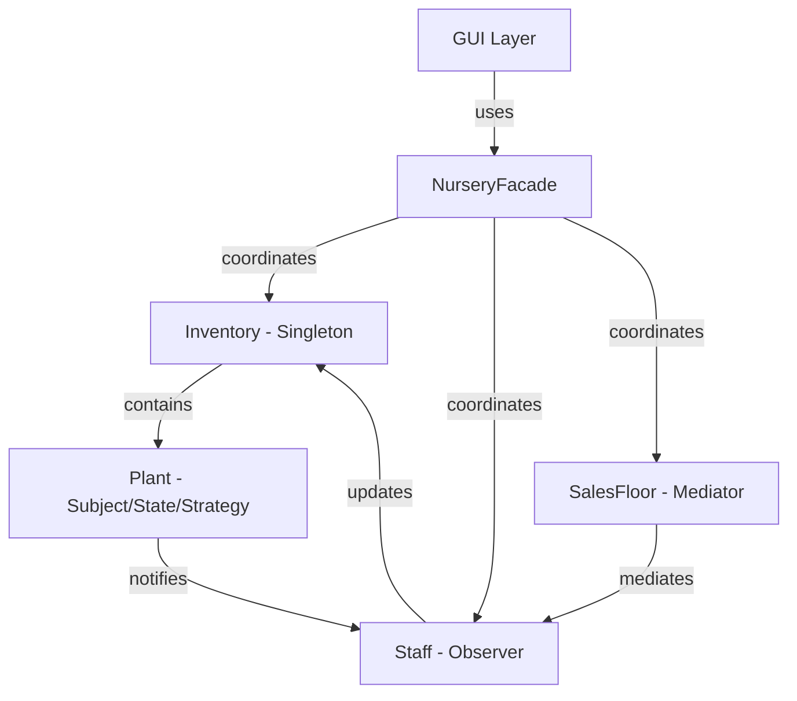

**Team Name:** Photosyntech  
**Project:** COS214 Final Project - Plant Nursery Simulator  
**Date:** October 2025  
**Version:** 1.0 (Draft)

---

## Table of Contents

1. [Executive Summary](https://claude.ai/chat/2c258cd4-adfa-4c13-8827-4be626304bb7#1-executive-summary)
2. [System Overview](https://claude.ai/chat/2c258cd4-adfa-4c13-8827-4be626304bb7#2-system-overview)
3. [Functional Requirements](https://claude.ai/chat/2c258cd4-adfa-4c13-8827-4be626304bb7#3-functional-requirements)
4. [Non-Functional Requirements](https://claude.ai/chat/2c258cd4-adfa-4c13-8827-4be626304bb7#4-non-functional-requirements)
5. [Design Patterns](https://claude.ai/chat/2c258cd4-adfa-4c13-8827-4be626304bb7#5-design-patterns)
6. [System Architecture](https://claude.ai/chat/2c258cd4-adfa-4c13-8827-4be626304bb7#6-system-architecture)
7. [Class Relationships](https://claude.ai/chat/2c258cd4-adfa-4c13-8827-4be626304bb7#7-class-relationships)
8. [Future Extensibility](https://claude.ai/chat/2c258cd4-adfa-4c13-8827-4be626304bb7#8-future-extensibility)

---

## 1. Executive Summary

The Photosyntech Plant Nursery Simulator is a C++ application designed to model the operations of a working plant nursery. The system encompasses three primary domains: greenhouse/garden operations, staff management, and customer interactions on the sales floor.

The design leverages **10+ design patterns** to ensure flexibility, maintainability, and scalability. Each pattern addresses specific design challenges while maintaining loose coupling and high cohesion across the system.

**Key Statistics:**

- **Design Patterns:** 11 (exceeds minimum requirement of 10)
- **Creational Patterns:** 4
- **Behavioral Patterns:** 5
- **Structural Patterns:** 2
- **Functional Requirements:** 15+
- **Non-Functional Requirements:** 3

---

## 2. System Overview

### 2.1 System Purpose

The Plant Nursery Simulator models:

- **Plant lifecycle management** from seed to mature sale-ready plants
- **Staff operations** including plant care, monitoring, and customer assistance
- **Customer interactions** including browsing, customization, and purchasing
- **Inventory tracking** across all system states

### 2.2 Primary Subsystems

#### **Greenhouse/Garden Area**

- Plant creation and growth
- Plant care management (watering, sunlight, fertilizer)
- Lifecycle state transitions
- Stock management

#### **Staff Management**

- Plant care execution
- Health and lifecycle monitoring
- Inventory coordination
- Customer assistance

#### **Sales Floor & Customers**

- Customer browsing and information requests
- Plant customization options
- Purchase transactions
- Staff-customer mediation

---

## 3. Functional Requirements
## 3. Functional Requirements

### 3.1 Greenhouse/Garden Subsystem

**FR1: Plant Construction with Builder**  
The system will provide builder classes that create plants with specific configurations such as water strategy, sun strategy and maturity state. A Director will coordinate the construction of custom plants, ensuring all required attributes are initialized.  
_Pattern: Builder_

**FR2: Plant Cloning**  
Cloning will allow new instances of plants to be created with copied attributes through the clone() method. This is used to efficiently recreate very specific versions of plants multiple times.  
_Pattern: Prototype_

**FR3: Dynamic Watering Strategy**  
Different watering strategies will be implemented that define the water amount and frequency for different types of plants. Watering strategies will change based on the lifecycle of the plant.  
_Pattern: Strategy_

**FR4: Dynamic Sun Strategy**  
Different sun strategies will be implemented that define the intensity and hours of sun needed for different types of plants.  
_Pattern: Strategy_

**FR5: Plant Lifecycle States**  
The system will manage maturity states, which specify minimum ages, growth rates and price increases/decreases. Automatic transitions between states based on the age of the plant will be implemented.  
_Pattern: State_

**FR6: Inventory Structure**  
Plants will be organised into a structure using Composite, where these structures can be individual plants or groups of plants. The system will implement operations that traverse through the structure and get the total amount of the contained plants. Plants will be grouped by categories but will ensure that individual plants will be handled in the same manner.  
_Pattern: Composite_

**FR7: Inventory Singleton**  
A single global inventory will be shared to ensure that customers and staff access the same inventory. The creation of multiple inventories will be prohibited.  
_Pattern: Singleton_

### 3.2 Staff Subsystem

**FR8: Plant State Monitoring**  
Staff members will observe assigned plants' states to receive notifications about the health changes and lifecycle changes of the observed plant. The system will notify the assigned staff of state changes.  
_Pattern: Observer_

**FR9: Inventory Monitoring**  
Staff will be notified of inventory changes from sales and stock increases and decreases. Multiple staff will be able to observe the same inventory, ensuring awareness of stock levels.  
_Pattern: Observer_

**FR10: Customer Interaction Mediation**  
A mediator will coordinate communication between staff and customers on the sales floor, allowing decoupling of the staff. The mediator will broadcast necessary inventory updates to customers and staff on the sales floor.  
_Pattern: Mediator_

### 3.3 Customer & Sales Floor Subsystem

**FR11: Plant Customization**  
Plants will be customisable, such as adding a charm or decorating the pot. Multiple decorators on a single plant will be possible, allowing wrapping on Plant objects. The Plant interface will be maintained such that decorated plants are treated the same as regular plants.  
_Pattern: Decorator_

**FR12: Seasonal Plant Browsing**  
The Iterator will traverse through the Composite Plant structure based on the season the plant is assigned to.  
_Pattern: Iterator_

**FR13: Command-Based Actions**  
Actions such as watering plants, selling plants and hiring/firing staff will be executed through Command objects.  
_Pattern: Command_

### 3.4 Additional Functional Requirements

**FR14: Plant Information Retrieval**  
The system shall provide detailed plant information including care requirements, pricing, and availability.

**FR15: Transaction Processing**  
The system shall process plant purchases, update inventory, and record transaction details.

**FR16: Stock Addition**  
The system shall support easy addition of new plant stock across all seasons and types.

## 4. Non-Functional Requirements
## 4. Non-Functional Requirements (Quality Attributes)

These specifications define how well the system performs, ensuring quality attributes such as performance, maintainability, usability, scalability, and reliability are met.

### 4.1 Performance (NFR1)

**Requirement:** The system must be able to execute all staff care routines for a simulation of up to 10,000 active plants within a single simulated day cycle to ensure smooth progression.  
**Rationale:** Ensures the system can handle large-scale nursery operations without performance degradation.  
**Implementation:** Efficient algorithms, proper data structures, and optimized observer notifications.

### 4.2 Maintainability/Extensibility (NFR2)

**Requirement:** The system must be implemented such that adding a new type of care routine or a new plant species requires modification to only a maximum of two existing classes or files.  
**Rationale:** Open/Closed Principle - open for extension, closed for modification.  
**Implementation:** Pattern-based architecture (Factory, Strategy, Builder) enables easy extension.

### 4.3 Usability (NFR3)

**Requirement:** The system must utilise a clear text/visual based interface where all available actions and input parameters are displayed to the user upon request. A new user without any prior knowledge of the system should be able to navigate the system using only the text based system.  
**Rationale:** Users should not need extensive training to use the system.  
**Implementation:** Intuitive menu system, clear prompts, and comprehensive help documentation.

### 4.4 Scalability (NFR4)

**Requirement:** The system must be able to handle a simulation with an inventory of up to 5,000 unique plant instances without memory exhaustion or a noticeable decrease in simulation speed.  
**Rationale:** Ensures the system scales to larger nursery operations.  
**Implementation:** Efficient memory management, object pooling where appropriate, and optimized data structures.

### 4.5 Reliability (NFR5)

**Requirement:** The whole system must be designed with distinct modules for the staff, greenhouse and customer interactions. This ensures that a change in one area does not break any functionality in any other area.  
**Rationale:** High cohesion, low coupling for system stability.  
**Implementation:** Clear separation of concerns through subsystems, well-defined interfaces, and comprehensive testing.

## 5. Design Patterns

### 5.1 Creational Patterns

---

#### **5.1.1 Abstract Factory Pattern**

**Purpose:** Create families of related plant objects (seasonal groupings) without specifying concrete classes.

**Problem Solved:**

- Need to create plants that belong to consistent seasonal families
- Ensure all plants from one factory share compatible characteristics
- Allow easy switching between seasonal catalogs

**Why This Pattern:**

- Guarantees consistency across product families (all spring plants together)
- Encapsulates object creation logic
- Makes it easy to add new seasons without changing client code

**Participants:**

|Role|Participant|Responsibility|
|---|---|---|
|**AbstractFactory**|`PlantFactory`|Declares interface for creating abstract products|
|**ConcreteFactory**|`SpringFactory`|Creates spring-specific plant family|
||`SummerFactory`|Creates summer-specific plant family|
||`AutumnFactory`|Creates autumn-specific plant family|
||`WinterFactory`|Creates winter-specific plant family|
|**AbstractProduct**|`Plant`|Defines interface for plant objects|
|**ConcreteProduct**|`SpringTree`, `SpringShrub`, `SpringFlower`, `SpringSucculent`|Spring plant implementations|
||`SummerTree`, `SummerShrub`, `SummerFlower`, `SummerSucculent`|Summer plant implementations|
||`AutumnTree`, `AutumnShrub`, `AutumnFlower`, `AutumnSucculent`|Autumn plant implementations|
||`WinterTree`, `WinterShrub`, `WinterFlower`, `WinterSucculent`|Winter plant implementations|
|**Client**|`Stock`, `Inventory`|Uses factories to create plants|

**Functional Requirements:** FR1, FR2

**Class Diagram:**

```
PlantFactory (interface)
├── createTree(): Plant
├── createShrub(): Plant
├── createFlower(): Plant
└── createSucculent(): Plant

ConcreteFactories implement PlantFactory:
├── SpringFactory
├── SummerFactory
├── AutumnFactory
└── WinterFactory

Plant (abstract)
├── SpringTree, SpringShrub, SpringFlower, SpringSucculent
├── SummerTree, SummerShrub, SummerFlower, SummerSucculent
├── AutumnTree, AutumnShrub, AutumnFlower, AutumnSucculent
└── WinterTree, WinterShrub, WinterFlower, WinterSucculent
```

---

#### **5.1.2 Prototype Pattern**

**Purpose:** Clone existing plant objects to create new instances without knowing their concrete classes.

**Problem Solved:**

- Need to create multiple copies of configured plants efficiently
- Avoid expensive initialization for similar plants
- Simulate bulk plant orders

**Why This Pattern:**

- More efficient than creating plants from scratch
- Preserves configuration of mature plants
- Supports flexible plant replication

**Participants:**

|Role|Participant|Responsibility|
|---|---|---|
|**Prototype**|`Plant`|Declares cloning interface|
|**ConcretePrototype**|`SpringTree`, `SummerFlower`, etc.|Implements cloning operation|
|**Client**|`Stock`, `Inventory`|Creates new plants by cloning existing ones|

**Functional Requirements:** FR3

**Key Methods:**

- `Plant* clone()` - Creates deep copy of plant with same configuration

---

#### **5.1.3 Singleton Pattern**

**Purpose:** Ensure only one instance of Inventory exists throughout the application.

**Problem Solved:**

- Prevent multiple inventory instances causing data inconsistency
- Provide global access point to inventory
- Centralize plant stock management

**Why This Pattern:**

- Guarantees single source of truth for inventory
- Prevents synchronization issues
- Simplifies access to inventory data

**Participants:**

|Role|Participant|Responsibility|
|---|---|---|
|**Singleton**|`Inventory`|Ensures single instance, provides global access|
|**Client**|`Staff`, `SalesFloor`, `Customer`|Access inventory through getInstance()|

**Functional Requirements:** FR8

**Key Methods:**

- `static Inventory* getInstance()` - Returns singleton instance
- Private constructor - Prevents direct instantiation
- Private copy constructor - Prevents copying

---

#### **5.1.4 Builder Pattern** _(Optional/Future)_

**Purpose:** Construct complex plant orders or customized plant configurations step-by-step.

**Problem Solved:**

- Need to create complex objects with many optional parameters
- Want to separate construction logic from representation
- Build different representations using same construction process

**Why This Pattern:**

- Handles complex plant configurations elegantly
- Separates construction code from business logic
- Allows same construction process for different plant types

**Participants:**

|Role|Participant|Responsibility|
|---|---|---|
|**Builder**|`PlantBuilder`|Specifies interface for creating parts of Product|
|**ConcreteBuilder**|`CustomPlantBuilder`|Constructs and assembles parts|
|**Director**|`NurseryDirector`|Constructs object using Builder interface|
|**Product**|`Plant`|Complex object being constructed|

**Functional Requirements:** Future extension for FR17 (complex transactions)

---

### 5.2 Behavioral Patterns

---

#### **5.2.1 Observer Pattern**

**Purpose:** Notify staff members automatically when plants change state or inventory is updated.

**Problem Solved:**

- Staff needs to monitor multiple plants without constant polling
- Inventory changes must be broadcast to multiple observers
- Loose coupling between plants and staff

**Why This Pattern:**

- Establishes one-to-many dependency
- Subjects notify observers automatically
- Observers can be added/removed dynamically

**Participants:**

|Role|Participant|Responsibility|
|---|---|---|
|**Subject**|`Plant`, `Inventory`|Maintains observer list, notifies on change|
|**Observer**|`Staff`|Receives notifications and responds to changes|
|**ConcreteSubject**|`SpringTree`, `Inventory`|Stores state, notifies when state changes|
|**ConcreteObserver**|`Gardener`, `SalesStaff`|Implements update interface, maintains reference to subject|

**Functional Requirements:** FR9, FR10

**Key Methods:**

- `attach(Observer*)` - Register observer
- `detach(Observer*)` - Remove observer
- `notify()` - Alert all observers
- `update()` - Observer response method

---

#### **5.2.2 Strategy Pattern**

**Purpose:** Define a family of plant care algorithms (watering, sunlight) and make them interchangeable.

**Problem Solved:**

- Different plants require different care strategies
- Avoid conditional logic for care routines
- Allow runtime strategy switching

**Why This Pattern:**

- Encapsulates algorithms in separate classes
- Makes algorithms interchangeable
- Eliminates conditional statements

**Participants:**

|Role|Participant|Responsibility|
|---|---|---|
|**Strategy**|`WaterStrategy`, `SunStrategy`|Declares interface for all strategies|
|**ConcreteStrategy**|`HighWaterStrategy`, `MediumWaterStrategy`, `LowWaterStrategy`|Implements specific watering algorithms|
||`FullSunStrategy`, `PartialSunStrategy`, `ShadeStrategy`|Implements specific sunlight algorithms|
|**Context**|`Plant`|Maintains reference to Strategy object, delegates to strategy|

**Functional Requirements:** FR4, FR5

**Strategy Families:**

**Water Strategies:**

- `HighWaterStrategy` - Frequent watering (3x per week)
- `MediumWaterStrategy` - Moderate watering (2x per week)
- `LowWaterStrategy` - Minimal watering (1x per week)

**Sun Strategies:**

- `FullSunStrategy` - 6+ hours direct sunlight
- `PartialSunStrategy` - 3-6 hours sunlight
- `ShadeStrategy` - Minimal direct sunlight

---

#### **5.2.3 State Pattern**

**Purpose:** Allow plants to change behavior based on their maturity state.

**Problem Solved:**

- Plant behavior varies with maturity level
- Avoid large conditional statements
- Encapsulate state-specific behavior

**Why This Pattern:**

- Localizes state-specific behavior
- Makes state transitions explicit
- Simplifies adding new states

**Participants:**

|Role|Participant|Responsibility|
|---|---|---|
|**Context**|`Plant`|Maintains current state, delegates state-specific requests|
|**State**|`MaturityState`|Defines interface for state-specific behavior|
|**ConcreteState**|`SeedState`|Implements behavior for seed stage|
||`MidGrowthState`|Implements behavior for mid-growth stage|
||`MatureState`|Implements behavior for mature/sale-ready stage|
||`DeadState`|Implements behavior for dead plants|

**Functional Requirements:** FR6

**State Behaviors:**

- `SeedState` - High growth rate, low price, not for sale
- `MidGrowthState` - Moderate growth rate, medium price, limited sale
- `MatureState` - No growth, full price, ready for sale
- `DeadState` - No growth, no value, requires removal

**Key Methods:**

- `water()` - State-specific watering behavior
- `grow()` - State-specific growth behavior
- `getPrice()` - State-dependent pricing

---

#### **5.2.4 Mediator Pattern**

**Purpose:** Coordinate interactions between staff and customers through a central mediator (SalesFloor).

**Problem Solved:**

- Staff and customers shouldn't reference each other directly
- Reduce coupling between interactive components
- Centralize communication logic

**Why This Pattern:**

- Reduces coupling between colleagues
- Centralizes control logic
- Simplifies object protocols

**Participants:**

|Role|Participant|Responsibility|
|---|---|---|
|**Mediator**|`Mediator`|Defines interface for communicating with colleagues|
|**ConcreteMediator**|`SalesFloor`|Implements cooperative behavior, coordinates colleagues|
|**Colleague**|`Staff`, `Customer`|Knows its mediator, communicates through mediator|

**Functional Requirements:** FR11

**Mediated Interactions:**

- Customer requests assistance → Mediator assigns available staff
- Staff updates availability → Mediator redistributes customers
- Customer asks question → Mediator routes to appropriate staff
- Transaction completion → Mediator notifies relevant parties

**Key Methods:**

- `requestAssistance(Customer*)` - Customer requests help
- `assignStaff(Customer*, Staff*)` - Mediator assigns staff
- `completeTransaction(Customer*, Plant*)` - Process purchase
- `updateAvailability(Staff*, bool)` - Staff availability changes

---

#### **5.2.5 Iterator Pattern**

**Purpose:** Provide sequential access to plant collections without exposing underlying representation.

**Problem Solved:**

- Need different ways to traverse plant collections (by season, type, maturity)
- Don't want to expose collection internals
- Support multiple simultaneous traversals

**Why This Pattern:**

- Separates collection from traversal
- Supports multiple iteration algorithms
- Provides uniform interface for different collections

**Participants:**

|Role|Participant|Responsibility|
|---|---|---|
|**Iterator**|`Iterator`|Defines interface for accessing elements|
|**ConcreteIterator**|`SpringIterator`, `SummerIterator`, `WinterIterator`, `AutumnIterator`|Implements iteration for seasonal plants|
||`PlantIterator`|Implements iteration for all plants|
|**Aggregate**|`Aggregate`|Defines interface for creating iterator|
|**ConcreteAggregate**|`PlantCollection`, `Stock`|Returns appropriate iterator instance|

**Functional Requirements:** FR13

**Iterator Types:**

- `SpringIterator` - Iterates spring plants only
- `SummerIterator` - Iterates summer plants only
- `AutumnIterator` - Iterates autumn plants only
- `WinterIterator` - Iterates winter plants only
- `PlantIterator` - Iterates all plants
- `MatureIterator` - Iterates only mature/sale-ready plants

**Key Methods:**

- `first()` - Reset to first element
- `next()` - Advance to next element
- `isDone()` - Check if traversal complete
- `currentItem()` - Return current element

---

#### **5.2.6 Command Pattern**

**Purpose:** Encapsulate GUI requests as objects, allowing parameterization and queuing of operations.

**Problem Solved:**

- Need to decouple GUI from business logic
- Support undo/redo functionality
- Queue and log operations

**Why This Pattern:**

- Decouples invoker from receiver
- Commands can be stored and manipulated
- Easy to add new commands

**Participants:**

|Role|Participant|Responsibility|
|---|---|---|
|**Command**|`Command`|Declares interface for executing operations|
|**ConcreteCommand**|`PurchasePlantCommand`|Defines binding between receiver and action|
||`WaterPlantCommand`|Implements execute by invoking operations on receiver|
||`AddToInventoryCommand`|Encapsulates add stock operation|
||`BrowsePlantsCommand`|Encapsulates browsing operation|
|**Invoker**|`GUIController`|Asks command to carry out request|
|**Receiver**|`NurseryFacade`|Knows how to perform operations|

**Functional Requirements:** FR15

**Command Examples:**

```cpp
class PurchasePlantCommand : public Command {
    NurseryFacade* facade;
    Plant* plant;
    Customer* customer;
public:
    void execute() {
        facade->purchasePlant(plant, customer);
    }
};
```

**Key Methods:**

- `execute()` - Perform command action
- `undo()` - Reverse command action (optional)

---

### 5.3 Structural Patterns

---

#### **5.3.1 Composite Pattern**

**Purpose:** Compose plants into tree structures to represent part-whole hierarchies.

**Problem Solved:**

- Need to treat individual plants and groups uniformly
- Organize plants hierarchically (categories, collections, bundles)
- Simplify client code dealing with complex structures

**Why This Pattern:**

- Treats individual objects and compositions uniformly
- Makes it easy to add new component types
- Simplifies client code

**Participants:**

|Role|Participant|Responsibility|
|---|---|---|
|**Component**|`PlantComponent`|Declares interface for objects in composition|
|**Leaf**|`Plant`|Represents leaf objects (individual plants)|
|**Composite**|`PlantCollection`, `Stock`|Stores child components, implements operations|
|**Client**|`Inventory`, `SalesFloor`|Manipulates objects through component interface|

**Functional Requirements:** FR7

**Composite Structure:**

```
Stock (Composite)
├── SpringCollection (Composite)
│   ├── SpringTree (Leaf)
│   ├── SpringFlower (Leaf)
│   └── SpringShrub (Leaf)
├── SummerCollection (Composite)
│   └── SummerTree (Leaf)
└── IndividualPlant (Leaf)
```

**Key Methods:**

- `add(PlantComponent*)` - Add child component
- `remove(PlantComponent*)` - Remove child component
- `getChild(int)` - Access child component
- `operation()` - Execute operation on self and children

---

#### **5.3.2 Decorator Pattern**

**Purpose:** Add responsibilities to plants dynamically (decorative pots, gift wrapping, care packages).

**Problem Solved:**

- Need to add features to plants flexibly
- Avoid explosion of subclasses for combinations
- Add/remove features at runtime

**Why This Pattern:**

- More flexible than static inheritance
- Responsibilities can be added/removed at runtime
- Combines features flexibly

**Participants:**

|Role|Participant|Responsibility|
|---|---|---|
|**Component**|`Plant`|Defines interface for objects that can have responsibilities added|
|**ConcreteComponent**|`SpringTree`, `SummerFlower`, etc.|Defines base object to which decorations are added|
|**Decorator**|`PlantDecorator`|Maintains reference to Component, forwards requests|
|**ConcreteDecorator**|`PotDecoration`|Adds decorative pot to plant|
||`GiftWrapDecoration`|Adds gift wrapping to plant|
||`CarePackageDecoration`|Adds care instruction package|

**Functional Requirements:** FR12

**Decoration Examples:**

```cpp
Plant* plant = new SpringTree();
plant = new PotDecoration(plant);           // Add pot
plant = new GiftWrapDecoration(plant);      // Add wrapping
plant = new CarePackageDecoration(plant);   // Add care package

double price = plant->getPrice();  // Returns total with decorations
```

**Key Methods:**

- `getPrice()` - Returns price including decorations
- `getDescription()` - Returns description with added features

---

#### **5.3.3 Facade Pattern**

**Purpose:** Provide a simplified interface to the complex plant nursery subsystems for GUI interaction.

**Problem Solved:**

- GUI shouldn't deal with complex subsystem interactions
- Reduce coupling between GUI and business logic
- Provide simple interface for common operations

**Why This Pattern:**

- Simplifies complex subsystems
- Promotes weak coupling
- Makes subsystems easier to use

**Participants:**

|Role|Participant|Responsibility|
|---|---|---|
|**Facade**|`NurseryFacade`|Provides unified interface to subsystems|
|**Subsystems**|`Inventory`|Complex subsystem for stock management|
||`StaffManager`|Complex subsystem for staff coordination|
||`SalesFloor`|Complex subsystem for sales operations|
||`Plant`|Plant entities and operations|
|**Client**|`GUIController`, `DearImGui`|Uses facade for simplified access|

**Functional Requirements:** FR14

**Facade Methods:**

- `purchasePlant(Plant*, Customer*)` - Handles complete purchase flow
- `waterPlant(Plant*, Staff*)` - Coordinates plant care
- `addStock(PlantFactory*, int)` - Adds new inventory
- `browsePlants(Season)` - Returns available plants by season
- `getPlantInfo(Plant*)` - Retrieves plant details

**Example Usage:**

```cpp
NurseryFacade* nursery = new NurseryFacade();

// Simple facade call handles complex subsystem coordination
nursery->purchasePlant(selectedPlant, customer);
// Internally: checks inventory, processes payment, updates stock,
//             notifies observers, records transaction
```

---

## 6. System Architecture

### 6.1 High-Level Architecture

```
┌─────────────────────────────────────────────────────┐
│                   GUI Layer                         │
│              (DearImGui / GUIController)            │
└──────────────────────┬──────────────────────────────┘
                       │ uses
                       ▼
┌─────────────────────────────────────────────────────┐
│                 Facade Layer                        │
│                (NurseryFacade)                      │
│          [Command Pattern for complex ops]          │
└──────────────────────┬──────────────────────────────┘
                       │ coordinates
                       ▼
┌─────────────────────────────────────────────────────┐
│              Business Logic Layer                   │
│  ┌──────────────┬───────────────┬─────────────┐     │
│  │  Greenhouse  │     Staff     │   Sales     │     │
│  │  Subsystem   │   Subsystem   │  Subsystem  │     │
│  └──────────────┴───────────────┴─────────────┘     │
│                                                     │
│  [Abstract Factory, Prototype, Strategy, State,     │
│   Observer, Mediator, Composite, Decorator]         │
└─────────────────────────────────────────────────────┘
```

### 6.2 Pattern Integration Map

**Creation Flow:**

```
Abstract Factory → creates → Concrete Plants
                             ↓
                        Prototype (cloning)
                             ↓
                        Composite (grouping)
                             ↓
                        Singleton Inventory
```

**Behavior Flow:**

```
Plant State changes → Observer → Staff notified
                                   ↓
Plant needs care ← Strategy ← Staff executes
                                   ↓
Customer interaction ← Mediator → Staff assists
                                   ↓
Purchase ← Decorator → Customized plant
```

**Interface Flow:**

```
GUI → Command → Facade → Subsystems
```

### 6.3 Subsystem Communication



---

## 7. Class Relationships

### 7.1 Core Class Hierarchy

```
Plant (Abstract)
├── Implements: Prototype (clone)
├── Uses: Strategy (WaterStrategy, SunStrategy)
├── Uses: State (MaturityState)
├── Implements: Observer Subject (notifies Staff)
└── Subclasses:
    ├── SpringTree, SpringShrub, SpringFlower, SpringSucculent
    ├── SummerTree, SummerShrub, SummerFlower, SummerSucculent
    ├── AutumnTree, AutumnShrub, AutumnFlower, AutumnSucculent
    └── WinterTree, WinterShrub, WinterFlower, WinterSucculent
```

### 7.2 Key Associations

- `PlantFactory` ──creates──> `Plant`
- `Plant` ──has──> `WaterStrategy`
- `Plant` ──has──> `SunStrategy`
- `Plant` ──has──> `MaturityState`
- `Plant` ──notifies──> `Staff` (Observer)
- `Inventory` ──contains──> `PlantCollection` (Composite)
- `PlantCollection` ──aggregates──> `Plant`
- `Staff` ──observes──> `Plant`
- `Staff` ──observes──> `Inventory`
- `SalesFloor` ──mediates──> `Staff` & `Customer`
- `PlantDecorator` ──wraps──> `Plant`
- `NurseryFacade` ──uses──> all subsystems
- `Command` ──uses──> `NurseryFacade`

---

## 8. Future Extensibility

### 8.1 Easy to Add

**New Seasons:**

- Create new `ConcreteFactory` (e.g., `RainySeasonFactory`)
- Create corresponding products (e.g., `RainySeasonTree`)
- No changes to existing code

**New Plant Types:**

- Add method to `PlantFactory` interface
- Implement in all concrete factories
- Define new product classes

**New Care Strategies:**

- Implement new `ConcreteStrategy` class
- Assign to plants at creation or runtime
- No changes to plant classes

**New Decorations:**

- Create new `ConcreteDecorator`
- Works with all existing plants automatically

**New Staff Roles:**

- Implement `Observer` interface
- Register with subjects
- No changes to plant or inventory classes

### 8.2 Extensibility Examples

**Adding Rare Season:**

```cpp
class RareSeasonFactory : public PlantFactory {
    Plant* createTree() { return new RareSeasonTree(); }
    Plant* createShrub() { return new RareSeasonShrub(); }
    // ... other creation methods
};
```

**Adding Fertilizer Strategy:**

```cpp
class FertilizerStrategy {
public:
    virtual void applyFertilizer(Plant* plant) = 0;
};

class OrganicFertilizer : public FertilizerStrategy {
    void applyFertilizer(Plant* plant) override {
        // Organic fertilizer logic
    }
};
```

**Adding Ribbon Decoration:**

```cpp
class RibbonDecoration : public PlantDecorator {
    double getPrice() override {
        return PlantDecorator::getPrice() + 5.00;
    }
    string getDescription() override {
        return PlantDecorator::getDescription() + ", with ribbon";
    }
};
```

---

## Appendix A: Pattern Summary Table

|Pattern|Type|Purpose|FR Mapping|
|---|---|---|---|
|Abstract Factory|Creational|Create seasonal plant families|FR1, FR2|
|Prototype|Creational|Clone plants efficiently|FR3|
|Singleton|Creational|Single inventory instance|FR8|
|Builder|Creational|Construct complex objects|Future|
|Observer|Behavioral|Notify staff of changes|FR9, FR10|
|Strategy|Behavioral|Interchangeable care algorithms|FR4, FR5|
|State|Behavioral|Plant maturity behaviors|FR6|
|Mediator|Behavioral|Coordinate staff-customer|FR11|
|Iterator|Behavioral|Traverse plant collections|FR13|
|Command|Behavioral|Encapsulate GUI operations|FR15|
|Composite|Structural|Organize plant hierarchies|FR7|
|Decorator|Structural|Add plant customizations|FR12|
|Facade|Structural|Simplify GUI interface|FR14|

---

## Appendix B: Design Principles Applied

### SOLID Principles

**Single Responsibility Principle:**

- Each pattern addresses one specific concern
- Classes have single, well-defined responsibilities

**Open/Closed Principle:**

- Open for extension (new seasons, strategies, decorations)
- Closed for modification (existing code unchanged)

**Liskov Substitution Principle:**

- All concrete plants substitutable for abstract Plant
- All concrete strategies substitutable for abstract Strategy

**Interface Segregation Principle:**

- Focused interfaces (Observer, Strategy, State)
- Clients depend only on methods they use

**Dependency Inversion Principle:**

- High-level modules depend on abstractions
- Concrete implementations depend on interfaces

### Additional Principles

**DRY (Don't Repeat Yourself):**

- Factory patterns eliminate duplicate creation code
- Strategy patterns eliminate duplicate care algorithms

**Composition over Inheritance:**

- Decorator uses composition for flexibility
- Strategy uses composition for interchangeable algorithms

**Loose Coupling:**

- Mediator reduces coupling between staff and customers
- Observer allows loose coupling between plants and staff

---

**Document Status:** Draft for Review  
**Next Steps:** Team review and approval, then finalization  
**Visual Paradigm Diagrams:** To be created from this specification

---

_End of Design Document_


---
---

# DESIGN DOCUMENT v2.0 - BUILDER PATTERN UPDATE

**Date:** October 2025  
**Version:** 2.0 (Builder Pattern Replacement)

---

## Change Log v2.0

**Major Change: Abstract Factory → Builder Pattern**

**Rationale:**
- Plants require many configurable attributes (type, season, water, sun, soil, growth rate, price, name, age)
- Builder provides superior flexibility for attribute combinations
- Reduces from 16 concrete plant classes to single Plant class + Builder
- Centralized validation logic
- Builder is on the required pattern list
- Easier to extend with new attributes

---

## Updated Functional Requirements

### Greenhouse/Garden Subsystem (REVISED)

**FR1: Configurable Plant Construction** ✨ NEW  
The system shall construct plants with multiple configurable attributes (type, season, water needs, sun requirements, growth rate, soil type, price, name) using a step-by-step builder process.  
_Pattern: Builder_

**FR2: Plant Attribute Validation** ✨ NEW  
The system shall validate plant attribute combinations during construction to ensure botanical consistency and prevent invalid configurations (e.g., cactus with high water needs).  
_Pattern: Builder_

**FR3-FR18:** Remain unchanged from v1.0

---

## 5.1.1 Builder Pattern (REPLACES Abstract Factory)

### Purpose
Construct complex plant objects with many configurable attributes step-by-step, separating construction from representation.

### Problem Solved
- Plants have many attributes (type, season, water, sun, soil, growth rate, price, name, etc.)
- Need flexible construction without constructor explosion
- Want to enforce attribute validation before object creation
- Avoid creating 16+ concrete subclasses for every combination

### Why This Pattern
- Handles objects with many optional/required parameters elegantly
- Provides control over construction process
- Enables step-by-step configuration with validation
- Separates complex construction logic from business logic
- Allows same construction process for different representations
- Eliminates telescoping constructor anti-pattern

### Participants

| Role | Participant | Responsibility |
|------|-------------|----------------|
| **Builder** | PlantBuilder | Specifies interface for creating parts of Product |
| **ConcreteBuilder** | PlantBuilder (single impl) | Constructs and assembles parts, validates configuration |
| **Director** | Client code / Stock | Constructs object using Builder (optional) |
| **Product** | Plant | Complex object being constructed |

### Functional Requirements
FR1, FR2

### Builder Interface Structure

```
PlantBuilder:
Methods:
- setType(PlantType): PlantBuilder&
- setSeason(Season): PlantBuilder&
- setWaterStrategy(WaterStrategy*): PlantBuilder&
- setSunStrategy(SunStrategy*): PlantBuilder&
- setGrowthRate(double): PlantBuilder&
- setSoilType(SoilType): PlantBuilder&
- setPrice(double): PlantBuilder&
- setName(string): PlantBuilder&
- setAge(int): PlantBuilder&
- validate(): bool
- build(): Plant*
- reset(): void
```

### Usage Example

**Creating a spring tree:**
```cpp
PlantBuilder builder;
Plant* springTree = builder
    .setType(PlantType::TREE)
    .setSeason(Season::SPRING)
    .setName("Cherry Blossom")
    .setWaterStrategy(new MediumWaterStrategy())
    .setSunStrategy(new FullSunStrategy())
    .setGrowthRate(0.6)
    .setSoilType(SoilType::LOAMY)
    .setPrice(75.00)
    .build();
```

**Creating a summer succulent:**
```cpp
builder.reset();
Plant* summerSucculent = builder
    .setType(PlantType::SUCCULENT)
    .setSeason(Season::SUMMER)
    .setName("Jade Plant")
    .setWaterStrategy(new LowWaterStrategy())
    .setSunStrategy(new FullSunStrategy())
    .setGrowthRate(0.2)
    .setSoilType(SoilType::SANDY)
    .setPrice(25.00)
    .build();
```

### Validation Logic

The builder's `build()` method validates:
- Succulents must have LowWaterStrategy
- Shade-loving plants shouldn't have FullSunStrategy
- Growth rate within valid range (0.0 - 1.0)
- Price is positive
- Required fields are set (type, season, name)

### Benefits Over Abstract Factory

✅ Single Plant class instead of 16 concrete classes  
✅ Flexible attribute combinations  
✅ Centralized validation  
✅ Easy to add new attributes (just add setter)  
✅ No factory hierarchy needed  
✅ Supports custom plant configurations

### Integration with Prototype

Builder and Prototype work together seamlessly:

```cpp
// Create template with Builder
Plant* template = builder
    .setType(TREE)
    .setSeason(SPRING)
    .setWaterStrategy(new MediumWaterStrategy())
    .build();

// Clone for bulk stock using Prototype
Plant* clone1 = template->clone();
Plant* clone2 = template->clone();
Plant* clone3 = template->clone();
```

---

## Updated Class Structure

### Single Plant Class (No Subclasses)

```
Plant:
Attributes:
- type: PlantType (TREE, SHRUB, FLOWER, SUCCULENT)
- season: Season (SPRING, SUMMER, AUTUMN, WINTER)
- name: string
- age: int
- growthRate: double
- soilType: SoilType
- price: double
- health: int
- waterStrategy: WaterStrategy*
- sunStrategy: SunStrategy*
- maturityState: MaturityState*
- observers: vector<Staff*>

Methods:
- clone(): Plant*
- getInfo(): string
- water(): void
- grow(): void
- getPrice(): double
- attach(Staff*): void
- detach(Staff*): void
- notify(): void
```

**No longer need:**
- SpringTree, SpringShrub, SpringFlower, SpringSucculent
- SummerTree, SummerShrub, SummerFlower, SummerSucculent
- AutumnTree, AutumnShrub, AutumnFlower, AutumnSucculent
- WinterTree, WinterShrub, WinterFlower, WinterSucculent

All 16 concrete classes replaced with single configurable Plant class!

---

## Pattern Count Summary (v2.0)

**Total: 11 patterns** (exceeds requirement of 10)

### Creational (3):
1. **Builder** ✨ (replaced Abstract Factory)
2. Prototype
3. Singleton

### Behavioral (6):
4. Observer
5. Strategy
6. State
7. Mediator
8. Iterator
9. Command

### Structural (3):
10. Composite
11. Decorator
12. Facade

**Required Patterns Used:**
- ✅ Builder (on required list)
- ✅ Observer
- ✅ Iterator
- ✅ Mediator
- ✅ Command
- ✅ Facade
- ✅ Singleton

**Pattern Distribution:**
- ✅ At least 2 of each type (Creational: 3, Behavioral: 6, Structural: 3)
- ✅ At least 5 required patterns used (7 used)

---

## Appendix: Builder vs Abstract Factory Decision

### Why Builder Was Chosen

**Attribute Complexity:**
Plants have many configurable attributes:
- Type, Season, Water needs, Sun requirements
- Growth rate, Soil type, Price, Name, Age
- Plus future: Fertilizer needs, Hardiness zone, etc.

**Abstract Factory Problems:**
- Requires 16+ concrete classes (4 seasons × 4 types)
- Adding soil type attribute → 80+ classes (5 soil types × 16)
- Limited flexibility for custom combinations
- Class explosion with each new categorization

**Builder Advantages:**
- Single Plant class with unlimited flexibility
- Easy to add new attributes (one setter method)
- Centralized validation ensures consistency
- Supports any attribute combination
- Dramatically reduces class count

**Trade-offs:**
- Lose explicit "seasonal family" grouping
- Season becomes just another attribute
- More verbose creation code (mitigated by fluent interface)

**Mitigation Strategies:**
- Iterator pattern still supports seasonal browsing
- Validation prevents inconsistent attribute combinations
- Fluent interface makes code readable
- Can add convenience methods for common configurations

---

*End of v2.0 Builder Pattern Update*
